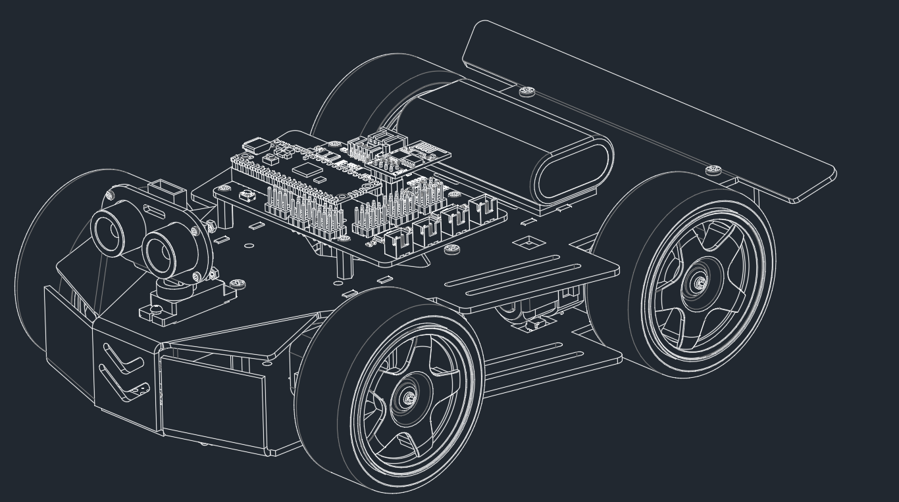

# SunFounder Pico-4wd Car Kit V2
This is the code, drivers and some documents for Pico-4wd Car.You can buy it on [our website](https://www.sunfounder.com/), or search sunfounder in Amazon.

- [Pico-4wd Car](#nano-sloth-kit)
- [Related Links](#related-links)
- [Sunfounder Controller](#sunfounder-controller)
- [File Tree](#file-tree)
- [About SunFounder](#about-sunfounder)
- [Contact Us](#contact-us)

## Pico-4wd Car

    
    &nbsp&nbsp&nbsp&nbsp&nbsp&nbsp&nbsp&nbsp&nbsp&nbsp&nbsp&nbsp&nbsp&nbsp
    <!--  -->

The Pico-4wd is a Raspberry Pi Pico based, cool, robot car kit that everyone can have.

Equipped with greyscale sensor module and ultrasonic module, it can perform line tracking, cliff detection, follow and obstacle avoidance functions. The RGB boards assembled at the bottom and rear of the car make it the coolest spirit in the dark.

We have provided sample code based on MicroPython so you can get started quickly.

In addition, you can also use an app - SunFounder Controller - to DIY your own control methods!

## Related Links
- documentation:
    https://docs.sunfounder.com/projects/pico-4wd-car/en/latest/index.html
- our website:
    https://sunfounder.com

## Sunfounder Controller
- https://docs.sunfounder.com/projects/sf-controller/en/latest/index.html
- layout:

    
    &nbsp&nbsp&nbsp&nbsp&nbsp&nbsp&nbsp&nbsp&nbsp&nbsp&nbsp&nbsp&nbsp&nbsp
    <!--  -->

## File Tree
    pico_4wd_car                               
    ├─ esp8266-uart-wsserver            // websocket-uart firmware for esp01s         
    ├─ examples                         // examples        
    │  ├─ app_control.py                       
    │  ├─ project_1_cliff.py                   
    │  ├─ project_2_line_track.py              
    │  ├─ project_3_follow.py                  
    │  ├─ project_4_avoid.py                   
    │  └─ project_5_light.py                   
    ├─ img                                     
    ├─ libs                             // library                          
    │  ├─ grayscale.py                         
    │  ├─ lights.py                            
    │  ├─ motor.py                             
    │  ├─ motors.py                            
    │  ├─ pico_4wd.py                          
    │  ├─ pico_rdp.py                          
    │  ├─ sonar.py                             
    │  ├─ servo.py                             
    │  ├─ speed.py                             
    │  ├─ ultrasonic.py                        
    │  ├─ ws.py                                
    │  └─ ws2812.py                            
    ├─ api_reference_pico_4wd.md               
    └─ README.md                               
## About SunFounder
SunFounder is a company focused on STEAM education with products like open source robots, development boards, STEAM kit, modules, tools and other smart devices distributed globally. In SunFounder, we strive to help elementary and middle school students as well as hobbyists, through STEAM education, strengthen their hands-on practices and problem-solving abilities. In this way, we hope to disseminate knowledge and provide skill training in a full-of-joy way, thus fostering your interest in programming and making, and exposing you to a fascinating world of science and engineering. To embrace the future of artificial intelligence, it is urgent and meaningful to learn abundant STEAM knowledge.

## Contact Us
website:
    <a href="https://www.sunfounder.com" target="_blank">www.sunfounder.com</a>

E-mail:
    service@sunfounder.com