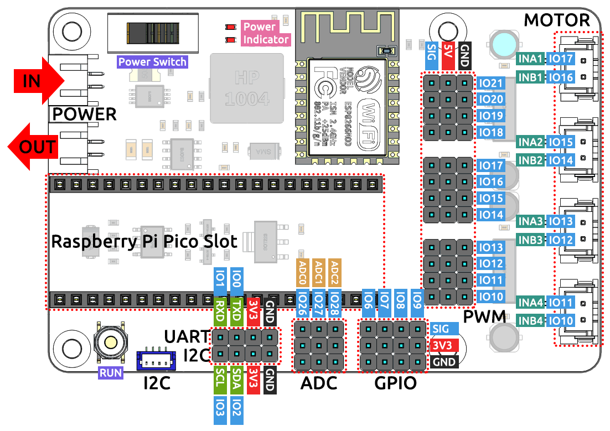

Introduction to Pico RDP
===================================

The Pico Robotics Development Platform (RDP) is a Wi-Fi extension module for the Raspberry Pi Pico designed by SunFounder.

It integrates industry-leading Wi-Fi solutions, rich peripheral interfaces, and supports multiple compilers for development.

It also has IO expansion interface circuitry, LED power indicator circuitry, voltage measurement circuitry, and an on-board 4-channel DC motor driver circuit.

When you use Pico RDP for development and debugging, you can connect peripherals as needed, and the rich external interfaces can make your projects more interesting.

**Features**

* Microcontroller: Raspberry Pi Pico module
* Wi-Fi: ESP8266 Wi-Fi module, 802.11 b/g/n (802.11n, speeds up to 150 Mbps), 2.4 GHz ~ 2.5 GHz frequency range
* RUN button: reset button
* Input voltage: 7.0-30.0V (PH2.0-2P)
* Output voltage: 7.0-30.0V (PH2.0-2P), 5.0V, 3.3V
* Output current: 5V/5A, 3.3V/1A
* One channel SH1.0-4P port: I2C port.
* Four channel XH2.54-4P port: DC motor port
* 12 x PWM channel, 3 x ADC channel, 4 x GPIO pins.
* One channel SH1.0-4P port: I2C port. Compatible with QwIIC and STEMMA QT

**Pico RDP's Pins**

Here is the schematic of the Pico RDP: :download:`PDF Pico RDP Schematic <https://github.com/sunfounder/sf-pdf/raw/master/schematic/pico-rdp.pdf>`.
