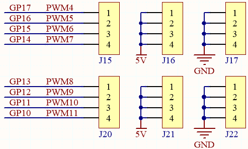

Pico RDP
===================================

Introduction
---------------------

The Pico Robotics Development Platform (RDP) is a Wi-Fi extension module for the Raspberry Pi Pico designed by SunFounder.

It uses the ESP01S module as a WiFi communication module for various remote control situations.

There are 12 channels of PWM pins, 3 channels of ADC pins, and 4 channels of GPIO pins reserved on this Pico RDP.

The Pico RDP also integrates two motor driver chips - TC1508S, which can drive 4 motors simultaneously.

Further, the Pico RDP has integrated battery charging circuitry, so you can plug in a 5V/2A USB-C cable directly to charge the included battery, which takes 130 minutes to fully charge.

Pico RDP Pinout
---------------------

* 3 groups of indicators.
    * **Charge Indicator**: This indicator lights up after plugging in the USC-C cable for charginge.
    * **Power Indicator**: Turn the power switch to ON, the power indicator will light up.
    * **Battery Indicators**: Two indicators represent different power levels. When both battery indicators are off, you need to use the USB-C cable to charge. When charging, these two indicators will flash.

* Battery Port：
    * 6.6V~8.4V PH2.0-5P power input.
    * Powering the Pico RDP and Raspberry Pi Pico at the same time.

* Power Switch
    * Slide to ON to power on the Pico RDP.

* :ref:`rdp_motor_pin`
    * 4 groups of motor ports.

* Charge Port
    * After plugging into the 5V/2A USB-C cable, it can be used to charge the battery for 130min.

* ESP01S Port
    * Used to plug in the ESP01S module.

* Raspberry Pi Pico Port
    * This connector is used to plug in the Raspberry Pi Pico, with the micro USB port facing outward.

.. _rdp_motor_pin:

Motor Port
----------------

There are four motor connectors on the Pico RDP, controlled by two TC1508S motor driver chips, which operate over a wide voltage range of 2.2 to 5.5V, with a maximum continuous output current of 1.8A.

.. image:: img/motor_tc1508s.png
    :width: 400

.. image:: img/tc1508s_pin.png

The following is a table of the input and output logic of the TC1508S chip.

.. list-table::

    * - Input
      - 
      - 
      - 
      - Output
      - 
      - 
      - 
      - Status
    * - INA
      - INB
      - INC
      - IND
      - OUTA
      - OUTB
      - OUTC
      - OUTD
      - 
    * - L
      - L
      - 
      - 
      - Hi-Z
      - Hi-Z
      - 
      - 
      - Standby
    * - H
      - L
      - 
      - 
      - H
      - L
      - 
      - 
      - Rotate
    * - L
      - H
      - 
      - 
      - L
      - H
      - 
      - 
      - Reverse direction of rotation
    * - H
      - H
      - 
      - 
      - L
      - L
      - 
      - 
      - Stop
    * - 
      - 
      - L
      - L
      - 
      - 
      - Hi-Z
      - Hi-Z
      - Standby
    * - 
      - 
      - H
      - L
      - 
      - 
      - H
      - L
      - Rotate
    * - 
      - 
      - L
      - H
      - 
      - 
      - L
      - H
      - Reverse direction of rotation
    * - 
      - 
      - H
      - H
      - 
      - 
      - L
      - L
      - Stop

Two TC1508S chips are used here to drive the four motors, and the corresponding schematic is shown below.

So the corresponding control pins of the 4 motor interfaces are shown below.

.. list-table::
    :widths: 25 50

    * - Raspberry Pi Pico
      - Pico RDP
    * - GP17
      - OUTA1
    * - GP16
      - OUTB1
    * - GP15
      - OUTA2
    * - GP14
      - OUTB2
    * - GP13
      - OUTA3
    * - GP12
      - OUTB3
    * - GP11
      - OUTA4
    * - GP10
      - OUTB4

