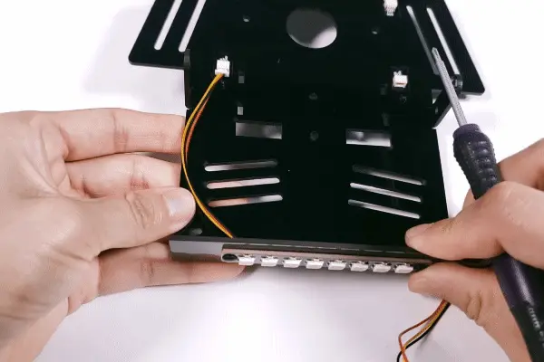
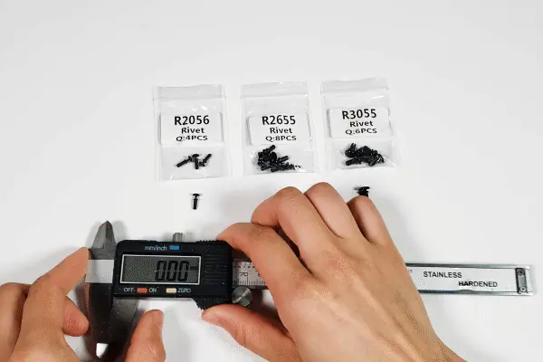

.. _assemble_the_car:

1. Assemble the Car
======================

Follow the PDF tutorial below to assemble the car first, and then refer to :ref:`play_mode` or :ref:`programming_mode` to make it move.

* :download:`(PDF)Pico-4wd V2.0 Assemble Instruction <https://github.com/sunfounder/sf-pdf/raw/master/assembly_file/z0201v20-a0000970%20pico-4wd.pdf>`

**Assemble Tutorial Video**

.. raw:: html

    <iframe width="700" height="400" src="https://www.youtube.com/embed/-G_JkrmgnVU" title="YouTube video player" frameborder="0" allow="accelerometer; autoplay; clipboard-write; encrypted-media; gyroscope; picture-in-picture; web-share" allowfullscreen></iframe>

**About Remove Rivets**

If you feel that the rivets are installed incorrectly, you can remove them by the method shown below.

**About the Rivet Size**

