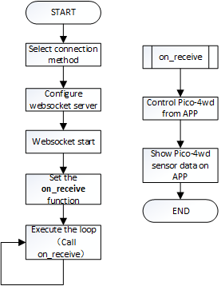

APP Control
=================

This section will guide you to use Sunfounder Controller APP to play pico-4wd remotely, which means you can use your phone/tablet to control it wandering around outdoors.

How to do?
-----------------

1. Coding

    To make things easier, let's use ``app_test.py`` in the **tests** folder (this code will be explained later) for the first Sunfounder Controller experiment!
    
    After running the program (Pico RDP should also be working at this time), Pico-4wd does not show anything, while the Thonny script shows the following message:
    
    .. code-block:: 

        >>> %Run -c $EDITOR_CONTENT
            Connecting
            WebServer started on ws://192.168.4.1:8765
            start

#. Install Sunfounder Controller

    Search for **Sunfounder Controller** in APP Store (or Google Play) and download it.

    .. image:: img/app_install.png

#. Connect to mobile devices.

    Find **my_4wd_car** on the WLAN of the mobile phone (tablet), enter the password (12345678) and connect to it. This is an ``AP`` released by Pico RDP and is not connected to the World Wide Web.
    
    If you need to keep the phone (tablet) network, you can switch to ``STA`` mode, which will be discussed later.

    After the connection is successful, the Thonny script will show the IP of the newly connected device:

    .. code-block:: python
        :emphasize-lines: 5

        >>> %Run -c $EDITOR_CONTENT
            Connecting
            WebServer started on ws://192.168.4.1:8765
            start
            Connected from 192.168.4.3    

#. Open **Sunfounder Controller** , and you will see the home page，click the **connect** icon on the top right corner to complete the connection between Pico-4wd and the phone (tablet).

    .. image:: img/app_home_page.jpg

    * The big **plus** button in the middle can create a controller, and you can create multiple controller schemes in Sunfounder Controller.
    * Click on the **exclamation mark** icon in the upper left corner to view "ABOUT US"
    * The red letter on the upper right shows the current connection status of Sunfounder Controller. If it is connected to a device (such as Pico-4wd), it will become a white font.
    * The **edit** icon allows you to delete redundant controllers.
    * You will need to click the **link** icon at the top right to connect to the mobile device. It should be noted that the Sunfounder Controller can connect successfully only when the device is running the program (you will need to reconnect after re-burning the code).

#. Create a controller, you will be able to see boxes (some are rectangles, some are squares), we need to adjust them to apply to ``app_test.py``.

    .. image:: img/app_test_controller_1.jpg

    Click on area D and select the **radar scanning** widget.

    .. image:: img/app_test_controller_2.jpg

    Click on area H and sclect the **Slider** widget。

    .. image:: img/app_test_controller_3.jpg

    Click the **save** icon at the top right, and the controller will be saved. At the same time it enters the working state, and the empty widget box is hidden.
    
    At this time, the original **save** icon will become an **edit** icon, click on it to return to the edit state to adjust the widget.

    .. image:: img/app_test_controller_4.jpg

#. Click the run icon next to the edit icon, Pico-4wd finally starts to move！
    

    If it fails to proceed as expected, or **Disconnected** is displayed next to the **Run** icon, please reconnect the Pico-4wd to the phone (tablet), and try again!
    
    * You will be able to see that the Pico-4wd radar is scanning, and the D box on the Sunfounder Controller will show the scan results.
    * If you flip the slider of the H box, the RGB Board at the rear of the car will lights up the corresponding lights.

How it works?
-----------------

The communication between Pico-4wd and Sunfounder Controller is based on the ``websocket protocol``.

* `WebSocket - Wikipedia <https://en.wikipedia.org/wiki/WebSocket>`_

Its function has been written in ``ws.py``, we have loaded it in the chapter :ref:`Import Pico-4wd Libraries`.

The specific workflow of APP Control gameplay is as follows:

**Code**

.. code-block:: python

    from ws import WS_Server
    import json
    import time
    import pico_4wd as car

    NAME = 'my_4wd_car'

    ## Client Mode
    # WIFI_MODE = "sta"
    # SSID = "YOUR SSID HERE"
    # PASSWORD = "YOUR PASSWORD HERE"

    ## AP Mode
    WIFI_MODE = "ap"
    SSID = ""
    PASSWORD = "12345678"

    ws = WS_Server(name=NAME, mode=WIFI_MODE, ssid=SSID, password=PASSWORD)
    ws.start()

    def on_receive(data):
        # write control codes here.
        pass
        
        # write sensor codes here.
        pass

    ws.on_receive = on_receive

    def main():
        print("start")
        while True:
            ws.loop()

    try:
        main()
    finally:
        car.move("stop")
        car.set_light_off()

This code constitutes the basic framework of APP control. Here, you need to pay attention to the following two parts:

1. Setup websocket

    There are two connection mode between Sunfounder Controller and Pico-4wd car: One is **AP** mode, the other is **STA** mode.

    * **AP Mode**: You need to connect Sunfounder Contorller to the hotspot released by Pico-4wd car.
    * **STA Mode**: You need to connect Sunfounder Controller and Pico-4wd car to the same LAN.
    
    The default connection mode is **AP Mode**: The car releases the hotspot (the Wifi name is ``NAME`` in the code, here is ``my_4wd_car``), the mobile phone (tablet) is connected to this WLAN. 
    This mode allows you to remotely control Pico-4wd in any situation, but will make your phone (tablet) temporarily unable to connect to the Internet.

    .. code-block:: python
        :emphasize-lines: 3,4,5,6,8,9,10,11

        NAME = 'my_4wd_car'

        ## Client Mode
        # WIFI_MODE = "sta"
        # SSID = "YOUR SSID HERE"
        # PASSWORD = "YOUR PASSWORD HERE"

        ## AP Mode
        WIFI_MODE = "ap"
        SSID = ""
        PASSWORD = "12345678"

        ws = WS_Server(name=NAME, mode=WIFI_MODE, ssid=SSID, password=PASSWORD)
        ws.start()

    You can also use **STA** mode: Let Pico-4wd car connects to your home WLAN, and your mobile phone (tablet) should also be connected to the same WLAN. 
    
    This mode is opposite to the **AP** mode and will not affect the normal use of the mobile phone (tablet), but will limit your Pico-4wd car from leaving the WLAN radiation range.

    The way to start this mode is to comment out the three lines under ``## AP Mode``, uncomment the three lines under ``## Client Mode``, and change the SSID and PASSWORD to your home WIFI at the same time.

    .. code-block:: python
        :emphasize-lines: 3,4,5,6,8,9,10,11

        NAME = 'my_4wd_car'

        ## Client Mode
        WIFI_MODE = "sta"
        SSID = "Sunfounder"
        PASSWORD = "12345678"

        ## AP Mode
        # WIFI_MODE = "ap"
        # SSID = ""
        # PASSWORD = "12345678"

        ws = WS_Server(name=NAME, mode=WIFI_MODE, ssid=SSID, password=PASSWORD)    
        ws.start()

    After completing the connection mode settings, Websocket will set up and start the server.

    .. code-block:: python

        ws = WS_Server(name=NAME, mode=WIFI_MODE, ssid=SSID, password=PASSWORD)    
        ws.start()    

#. Responding

    The specific operation code of Pico-4wd and Sunfounder Controller is written on the ``on_receive()'' function. Usually, we need to write the codes for APP to control Pico-4wd on the front and the codes for APP to show Pico-4wd sensor data on the back.

    .. code-block:: python

        def on_receive(data):
            # write control codes here.
            pass
            
            # write sensor codes here.
            pass

        ws.on_receive = on_receive
    
    As shown below, we have written the controls code for the H area slider to control the number of lights on the RGB Board; and the sensor codes for the D area to show the radar detection results.

    .. code-block:: python

        def on_receive(data):
            # write control codes here.            
            num = int(data['H_region']*9/100)
            for i in range(0,num):
                car.write_light_color_at(i, [80, 50, 0])
            for i in range(num,8):
                car.write_light_color_at(i, [0, 0, 0])
            car.light_excute()
            
            # write sensor codes here.
            data = car.get_radar_distance()
            print(data)
            ws.send_dict['D_region'] = data

        ws.on_receive = on_receive

    Finally, ``on_receive()`` will be assigned to ``ws.on_receive`` and then called by ``ws.loop``.

Transfer Data
------------------------------------

**From APP to Pico-4wd**

    Let's take a look at what kind of data Pico-4wd will get from the APP. Print ``data`` directly in ``on_receive``.

    .. code-block:: python

        def on_receive(data):
            # write control codes here.
            print(data)
            
            # write sensor codes here.
            pass

    You will be able to see the following string:

    .. code-block:: python

        {'J_region': None, 'A_region': None, 'L_region': None, 'K_region': None, 'F_region': None, 'M_region': None, 'H_region': 50, 'Q_region': None, 'G_region': None, 'I_region': None, 'B_region': None, 'D_region': None, 'C_region': None, 'N_region': None, 'E_region': None, 'P_region': None, 'O_region': None}

    As we can see, the value of H Box is 50 (``H_region': 50``), and the others are None. This is because we only add one control widget (H Box). The widget in the D area is not used for control but only for show.

    We can also add other control widgets, and use the same method to view the values ​​sent by these widgets to Pico-4wd.

    You can get the value of the corresponding widget by just using the label. As shown below, print the value of the H Box widget:

    .. code-block:: python

        def on_receive(data):
            # write control codes here.
            print(data['H_region'])
            
            # write sensor codes here.
            pass
    
    .. code-block:: python

        >>> %Run -c $EDITOR_CONTENT
            Connecting
            WebServer started on ws://192.168.4.1:8765
            start
            Connected from 192.168.4.3
            50
            50
            50

    As shown below, use the obtained H Box widget (Slider) value to control the RGB Board at the rear of the car.

    .. code-block:: python

        def on_receive(data):
            # write control codes here.            
            num = int(data['H_region']*9/100)
            for i in range(0,num):
                car.write_light_color_at(i, [80, 50, 0])
            for i in range(num,8):
                car.write_light_color_at(i, [0, 0, 0])
            car.light_excute()

    You can use `API <https://github.com/sunfounder/pico_4wd_car/blob/main/api_reference_pico_4wd.md>`_ file to help you understand the functions in the code.

**From Pico-4wd to APP**

    Now let's see what kind of data Pico-4wd will send to the APP. The following code is used to obtain the ultrasonic detection distance.

    .. code-block:: python

        def on_receive(data):
            # write sensor codes here.
            data = car.get_radar_distance()
            print(data)

    .. code-block:: python

        >>> %Run -c $EDITOR_CONTENT
            Connecting
            WebServer started on ws://192.168.4.1:8765
            start
            Connected from 192.168.4.2
            [-10, 49.249]
            [-20, 37.417]
            [-30, 38.947]
            [-40, 36.193]
            [-50, 40.12]
            [-60, 36.431]  
    
    You can use `API <https://github.com/sunfounder/pico_4wd_car/blob/main/api_reference_pico_4wd.md>`_ file to help you understand the functions in the code.

    Now use the ``send_dict'' function to show the distance value in D Widget.

    .. code-block:: python

        def on_receive(data):
            # write sensor codes here.
            data = car.get_radar_distance()
            print(data)
            ws.send_dict['D_region'] = data

APP Control Example
----------------------------

Now, please open de ``app_control.py`` in **examples** and try the complete APP remote control gameplay!

.. image:: img/app_control_example.jpg

.. code-block:: python

    from ws import WS_Server
    import json
    import time
    import pico_4wd as car

    NAME = 'my_pico_car'

    # Client Mode
    # WIFI_MODE = "sta"
    # SSID = "YOUR_SSID_HERE"
    # PASSWORD = "YOUR_PASSWORD_HERE"

    # AP Mode
    WIFI_MODE = "ap"
    SSID = ""
    PASSWORD = "12345678"

    ws = WS_Server(name=NAME, mode=WIFI_MODE, ssid=SSID, password=PASSWORD)
    ws.start()
    led_status = False

    def on_receive(data):
        global led_status

        #Move
        if 'K_region' in data.keys() and 'H_region' in data.keys():
            # print(data['K_region'])
            if data['K_region'] == "left":
                car.write_light_color_at(0, [0, 0, 0])
                car.write_light_color_at(1, [0, 0, 0])
                car.write_light_color_at(6, [50, 50, 0])
                car.write_light_color_at(7, [50, 50, 0])
            elif data['K_region'] == "right":
                car.write_light_color_at(0, [50, 50, 0])
                car.write_light_color_at(1, [50, 50, 0])
                car.write_light_color_at(6, [0, 0, 0])
                car.write_light_color_at(7, [0, 0, 0])
            else:
                car.write_light_color_at(0, [0, 0, 0])
                car.write_light_color_at(1, [0, 0, 0])
                car.write_light_color_at(6, [0, 0, 0])
                car.write_light_color_at(7, [0, 0, 0])
            car.light_excute()
                
            car.move(data['K_region'], data['H_region'])
        
        # RGB LED
        if 'M_region' in data.keys():
            led_status = data['M_region']
                
        # speed measurement
        ws.send_dict['A_region'] = car.speed()
        if led_status:
            # HUE color system, Red is 0, and Green is 120
            hue = car.mapping(car.speed(), 0, 70, 120, 0)
            rgb = car.hue2rgb(hue)
            car.set_light_bottom_color(rgb)
        else:
            car.set_light_off()
        
        # radar
        ws.send_dict['D_region'] = car.get_radar_distance()
        
        # greyscale
        ws.send_dict['L_region'] = car.get_grayscale_values()

    ws.on_receive = on_receive

    def main():
        print("start")
        while True:
            ws.loop()

    try:
        main()
    finally:
        car.move("stop")
        car.set_light_off()

Widget List
--------------------------------

The control widgets are shown in the table:

.. image:: img/app_widget_control.png

The data widgets are shown in the table:

.. image:: img/app_widget_display.png