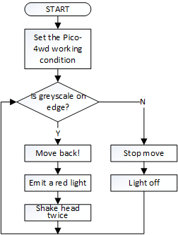

Don’t Push Me
================

Let us give Pico-4wd a little **self-protection awareness** and let it learn to use its own grayscale module to avoid rushing down the cliff.

In this example, the car will be dormant. If you push it to a cliff, it will be awakened urgently, then back up, and shake its head to express dissatisfaction. Please open ``donot_push_me.py`` to use this example.

How it Work?
--------------

Code
----------------

.. code-block:: python

    import pico_4wd as car
    import time

    car.GRAYSCALE_EDGE_REFERENCE = 500
    MOTOR_POWER = 50

    def shake_head():
        for angle in range(0, 90, 10):
            print("angle:%s "%angle)
            car.servo.set_angle(angle)
            time.sleep(0.01)
        for angle in range(90, -90, -10):
            print("angle:%s "%angle)
            car.servo.set_angle(angle)
            time.sleep(0.01)
        for angle in range(-90, 0, 10):
            print("angle:%s "%angle)
            car.servo.set_angle(angle)
            time.sleep(0.01)

    def main():
        while True:
            if car.is_greyscale_on_edge():
                car.move("backward", MOTOR_POWER)
                car.set_light_all_color([100, 0, 0])
                shake_head()
                shake_head()
            else:
                car.move("stop", MOTOR_POWER)
                car.set_light_off()

    try:
        main()
    finally:
        car.move("stop")
        car.set_light_off()