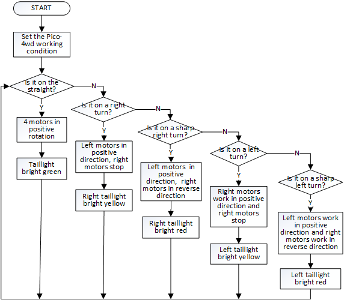

Line Track
===================

|example_line|

Let Pico-4wd walk on its exclusive avenue! Use 1cm of black insulating tape to paste a track on a light-colored ground (or desktop). Run this program, and you will see Pico-4wd sprinting into the track.

.. warning::
    In sharp bend will cause derailment!

There are some small eggs in this program: When the Pico-4wd is going straight, the tail light (the RGB Board at the tail) will light up in green; when turning, the side of the tail light will light up in yellow; 
when turning sharply, the side of the tail light will light up in red.

Code
----------------

.. note::

    * Open the ``line_track.py`` file under the path of ``pico_4wd_car\examples`` or copy this code into Thonny, then click "Run Current Script" or simply press F5 to run it.

    * Don't forget to click on the "MicroPython (Raspberry Pi Pico)" interpreter in the bottom right corner. 

    * For detailed tutorials, please refer to :ref:`open_run_code_py`. 

.. code-block:: python

    import pico_4wd as car

    MOTOR_POWER = 100
    car.GRAYSCALE_LINE_REFERENCE = 10000

    def main():
        while True:
            gs_data = car.get_greyscale_status()
            if gs_data == [0, 1, 0]:
                car.set_motor_power(MOTOR_POWER, MOTOR_POWER, MOTOR_POWER, MOTOR_POWER)
                car.set_light_bottom_color([0, 100, 0])
            elif gs_data == [0, 1, 1]:
                car.set_motor_power(MOTOR_POWER, 0, MOTOR_POWER, 0)
                car.set_light_off()
                car.set_light_bottom_left_color([50, 50, 0])
            elif gs_data == [0, 0, 1]:
                car.set_motor_power(MOTOR_POWER, -MOTOR_POWER, MOTOR_POWER, -MOTOR_POWER)
                car.set_light_off()
                car.set_light_bottom_left_color([100, 5, 0])
            elif gs_data == [1, 1, 0]:
                car.set_motor_power(0, MOTOR_POWER, 0, MOTOR_POWER)
                car.set_light_off()
                car.set_light_bottom_right_color([50, 50, 0])
            elif gs_data == [1, 0, 0]:
                car.set_motor_power(-MOTOR_POWER, MOTOR_POWER, -MOTOR_POWER, MOTOR_POWER)
                car.set_light_off()
                car.set_light_bottom_right_color([100, 0, 0])

    try:
        main()
    finally:
        car.move("stop")
        car.set_light_off()

How it Works
--------------

