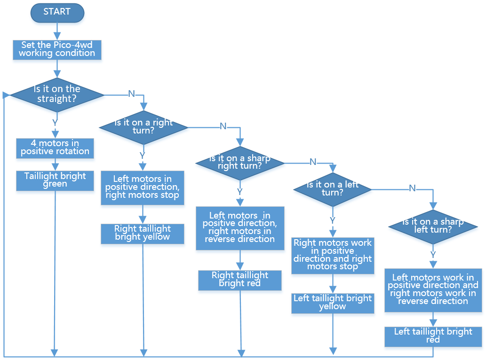

Line Track
===================

让Pico-4wd走在它的专属跑道上！用1cm的黑色绝缘胶带在浅色的地面（或桌面）贴出一条轨道，运行这个程序，你会看到Pico-4wd会沿着轨道疾奔。

.. warning::
    在过急的弯道会导致脱轨！

这个程序还有一些小彩蛋： Pico-4wd在直行时，尾灯（尾部的RGB Board）会亮起绿灯；在转弯时，尾灯一侧会亮起黄灯；在急转弯时，尾灯一侧会亮起红灯。

程序流程
--------------

代码
----------------

.. code-block:: python

    import pico_4wd as car

    MOTOR_POWER = 100
    car.GRAYSCALE_LINE_REFERENCE = 10000

    def main():
        while True:
            gs_data = car.get_greyscale_status()
            if gs_data == [0, 1, 0]:
                car.set_motor_power(MOTOR_POWER, MOTOR_POWER, MOTOR_POWER, MOTOR_POWER)
                car.set_light_bottom_color([0, 100, 0])
            elif gs_data == [0, 1, 1]:
                car.set_motor_power(MOTOR_POWER, 0, MOTOR_POWER, 0)
                car.set_light_off()
                car.set_light_bottom_left_color([50, 50, 0])
            elif gs_data == [0, 0, 1]:
                car.set_motor_power(MOTOR_POWER, -MOTOR_POWER, MOTOR_POWER, -MOTOR_POWER)
                car.set_light_off()
                car.set_light_bottom_left_color([100, 5, 0])
            elif gs_data == [1, 1, 0]:
                car.set_motor_power(0, MOTOR_POWER, 0, MOTOR_POWER)
                car.set_light_off()
                car.set_light_bottom_right_color([50, 50, 0])
            elif gs_data == [1, 0, 0]:
                car.set_motor_power(-MOTOR_POWER, MOTOR_POWER, -MOTOR_POWER, MOTOR_POWER)
                car.set_light_off()
                car.set_light_bottom_right_color([100, 0, 0])

    try:
        main()
    finally:
        car.move("stop")
        car.set_light_off()