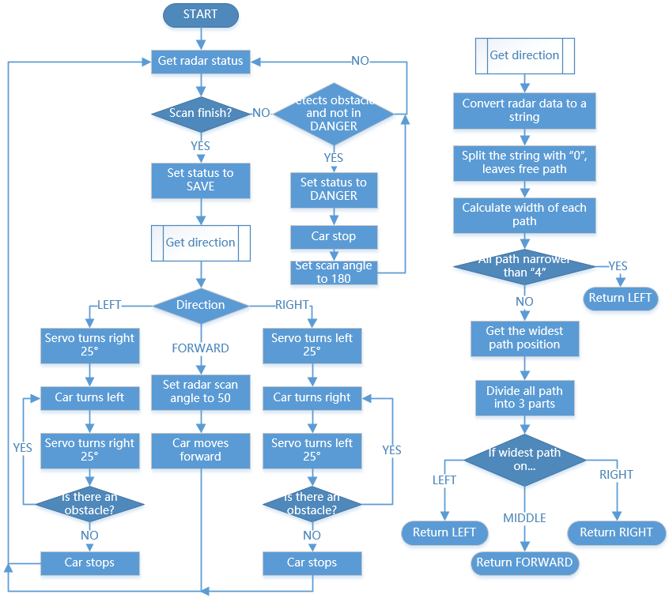

Obstacle Avoid
==========================

Let Pico-4wd do a challenging task: automatic obstacle avoidance! Instead of simply stepping back when an obstacle is detected, the radar scans the surrounding area to find the widest road.

You can build a goal of the right size and watch it find the right place and slowly cross it.

How it Works
--------------

Code
----------------
.. code-block:: python

    import pico_4wd as car
    import time

    car.RADAR_REFERENCE = 20
    car.RADAR_STEP_ANGLE = 10
    MOTOR_FORWARD_POWER = 30
    MOTOR_TURNING_POWER = 50

    FORWARD_SCAN_ANGLE = 50

    car.set_radar_scan_angle(FORWARD_SCAN_ANGLE)
    status = "Danger"

    def get_dir(radar_data):
        # get scan status of 0, 1
        # print(radar_data)
        radar_data = [str(i) for i in radar_data]
        radar_data = "".join(radar_data)
        # Split 0, leaves the free path
        paths = radar_data.split("0")
        # print(paths)
        # print("paths: %s" % paths)
        length_list = []
        # Calculate where is the widest
        for path in paths:
            length_list.append(len(path))
        if max(length_list) < 4:
            return "left"
        # Calculate the direction of the widest 
        i = length_list.index(max(length_list))
        pos = radar_data.index(paths[i])
        pos += (len(paths[i]) - 1) / 2
        delta = len(radar_data) / 3
        
        if pos < delta:
            return "right"
        elif pos > 2 * delta:
            return "left"
        else:
            return "forward"

    def main():
        # General
        while True:
            radar_data = car.radar_scan()
            # print("radar_data: %s" % radar_data)
            # If radar data return a int, means scan not finished, and the int is current angle status
            if isinstance(radar_data, int):
                if radar_data == 0 and status != "Danger":
                    print("Danger!")
                    status = "Danger"
                    car.move("stop")
                    car.set_radar_scan_angle(180)
                continue
            else:
                status = "Save"
            
            direction = get_dir(radar_data)

            if direction == "left":
                print("turn left")
                distance = car.get_radar_distance_at(FORWARD_SCAN_ANGLE/2)
                time.sleep(0.5)
                car.move("left", MOTOR_TURNING_POWER)
                while True:
                    distance = car.get_radar_distance_at(FORWARD_SCAN_ANGLE/2)
                    status = car.get_radar_status(distance)
                    if status == 1:
                        break
                car.move("stop")
                car.set_radar_scan_angle(FORWARD_SCAN_ANGLE)
            elif direction == "right":
                print("turn right")
                distance = car.get_radar_distance_at(-FORWARD_SCAN_ANGLE/2)
                time.sleep(0.5)
                car.move("right", MOTOR_TURNING_POWER)
                while True:
                    distance = car.get_radar_distance_at(-FORWARD_SCAN_ANGLE/2)
                    status = car.get_radar_status(distance)
                    if status == 1:
                        break
                car.move("stop")
                car.set_radar_scan_angle(FORWARD_SCAN_ANGLE)
            else:
                print("forward")
                car.set_radar_scan_angle(FORWARD_SCAN_ANGLE)
                car.move("forward", MOTOR_FORWARD_POWER)

    try:
        main()
    finally:
        car.move("stop")
        car.set_light_off()