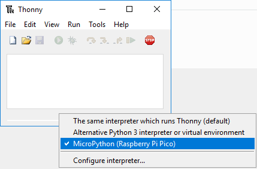
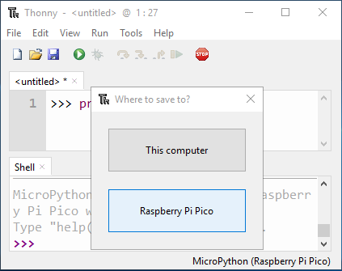

5. FAQ
=========

Q1: NO MicroPython(Raspberry Pi Pico) Interpreter Option on Thonny IDE?
--------------------------------------------------------------------------

* Check that your Pico is plugged into your computer via a USB cable.
* Check that you have installed MicroPython for Pico (:ref:`install_micropython_on_pico`).
* The Raspberry Pi Pico interpreter is only available in version 3.3.3 or higher version of Thonny. If you are running an older version, please update (:ref:`thonny_ide`).
* Plug in/out the micro USB cable sveral times.

Q2: Cannot open Pico code or save code to Pico via Thonny IDE?
------------------------------------------------------------------------

* Check that your Pico is plugged into your computer via a USB cable.
* Check that you have selected the Interpreter as **MicroPython (Raspberry Pi Pico)**.

Q3: Unable to connect to COM51: Cannot configure port?
---------------------------------------------------------------

.. code-block::

    Unable to connect to COM51: Cannot configure port, something went wrong. Original message: PermissionError(13, 'A device attached to the system is not functioning.', None, 31)

    If you have serial connection to the device from another program, then disconnect it there first.

    Process ended with exit code 1.

When you plug in your Raspberry Pi Pico to your computer, some times the above error message will appear, at this time you need to re-plug the USB cable and reopen the Thonny IDE.

.. _stt_android:

Q4：How can I use the STT mode on my Android device?
------------------------------------------------------------------------

Android devices cannot use the STT mode. Because the STT mode requires the Android mobile device to be connected to the Internet and to install the Google service component.

Now follow the steps below.

#. Modify the AP mode of ``app_control.py`` to STA mode.

    * Open the ``app_control.py`` under the path of ``pico_4wd_car-v2.0\examples\learn_modules``. 
    * Then comment out the AP mode related code. Uncomment the STA mode related co'decode and fill in  the ``SSD`` and ``PASSWORD`` of your home Wi-Fi.

        .. image:: img/sta_mode.png

    * Click **File** -> **Save as**.

        .. image:: img/save_as.png

    * Select **Raspberry Pi Pico** in the pop-up window.

        .. image:: img/save_to_pico.png

    * After that, save ``app_control.py`` to Raspberry Pi Pico with a new name - ``main.py``.

        .. image:: img/save_main.png

#. Search ``google`` in Google Play, find the app shown below and install it.

    .. image:: img/google_voice.png

#. Connect your mobile device to the same Wi-Fi as you wrote in the script.

    .. image:: img/sta_wifi.png

#. Open the controller previously created in SunFounder Controller and connect it to ``my_4wd_car``.

    .. image:: img/sta_connect.png

#. Tap and hold the **STT(I)** widget after clicking the |app_run| button. A prompt will appear indicating that it is listening. Say the following command to move the car.

    .. image:: img/sta_listening.png

    * ``stop``: All movements of the car can be stopped.
    * ``forward``: Let the car move forward.
    * ``backward``：Let the car move backward.
    * ``left``：Let the car turn left.
    * ``right``：Let the car turn right.
