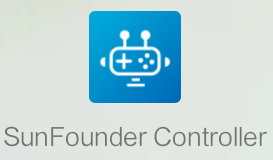
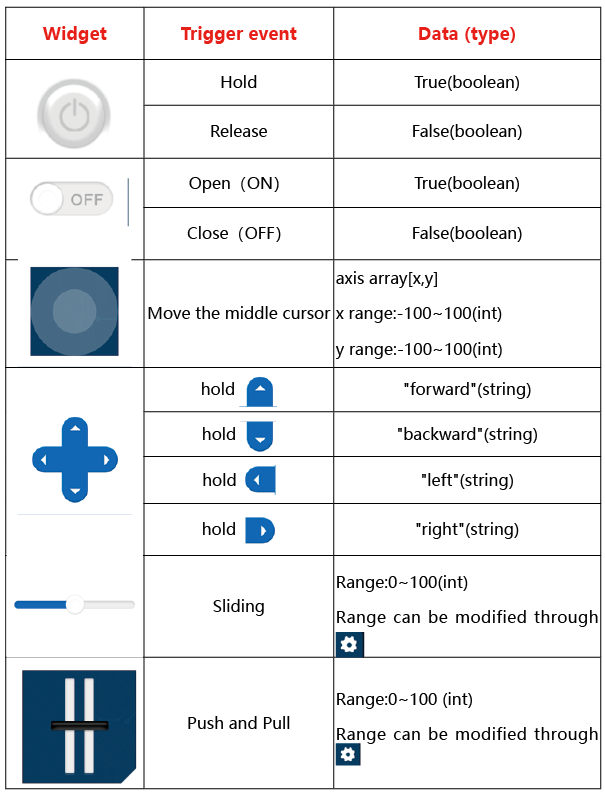

About Sunfounder Controller
====================================

Page Introduction
----------------------------

Start the Sunfounder Controller.

Click the middle button to add a new controller.

Sunfounder Controller is a platform that can add custom controllers. It reserves many widget interfaces. There are a total of 17 areas from A to Q. Each area has selectable widgets.

.. image:: img/arduino_app4.png

The available widgets in the **large square** area include joystick and D-Pad.

.. image:: img/arduino_app5.png

The available widgets in the **small square** area include button, digital display and switch.

.. image:: img/arduino_app6.png

The available widgets for the **rectangular** area include slider, dial, ultrasonic radar and grayscale detection tool.

Widgets List
----------------------

The control widgets are shown in the table:

The data widgets are shown in the table:

