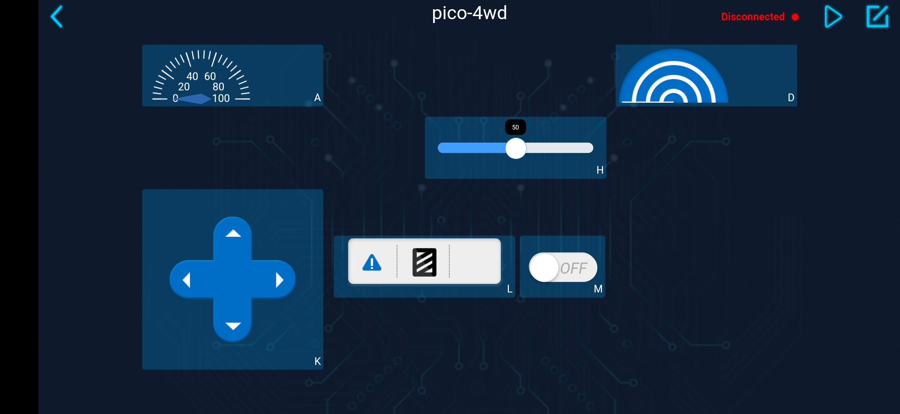

EXAMPLE - Control the Car with APP
-----------------------------------------------

**How to do？**

#. Make the ``app_control.py`` file run on boot.

    为了让Pico-4wd能够在不连接电脑的情况下，也能运行特定的脚本，然后被SunFounder Controller控制。你需要将特定的脚本以名字main.py存储到树莓派Pico中，具体步骤如下：

    * Open the ``app_control.py`` file under the path of ``pico_4wd_car_main\examples``.

        .. image:: img/app_control1.png
    
    * Press ``Ctrl+Shift+S`` and select **Raspberry Pi Pico** in the popup window that appears. If this pop-up does not appear on yours, make sure you have plugged the Pico into your computer with a micro USB cable and select the "MicroPython (Raspberry Pi Pico).COMXX" interpreter in the bottom right corner.

        .. image:: img/app_control2.png

    * Set the file name to ``main.py``. If you already have the same file in your Pico, it will prompt to overwrite it.

        .. image:: img/app_control3.png

    * 现在你就可以拔掉USB线，打开Pico-4wd的电源开关，Pico-4wd将自动运行这个 ``main.py`` 脚本。

#. Create a controller.

Now, please open the ``app_control.py`` in **examples** and try the complete APP remote control gameplay!

#. Connect to Pico-4wd.

