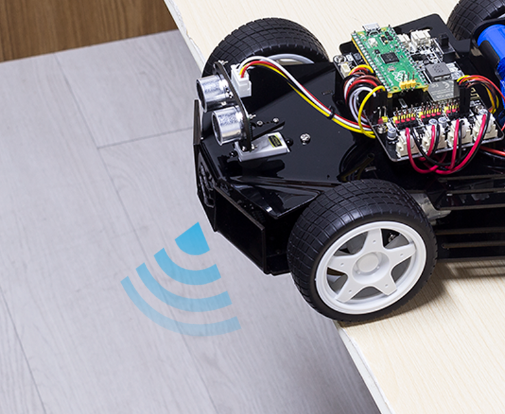

Don’t Push Me
================

Let us give Pico-4wd a little **self-protection awareness** and let it learn to use its own grayscale module to avoid rushing down the cliff.

In this example, the car will be dormant. If you push it to a cliff, it will be awakened urgently, then back up, and shake its head to express dissatisfaction.

**How to do？**

#. Select Correct Interpreter

    Plug the Pico into your computer with a micro USB cable and select the "MicroPython (Raspberry Pi Pico).COMXX" interpreter in the bottom right corner.

    .. image:: img/sec_inter.png

#. Go to the ``pico_4wd_car_main/examples`` path and double click on ``donot_push_me.py`` to open it.

    .. image:: img/do_push1.png

#. Click the **Run current script** button or just press F5 to run it.

    .. image:: img/run_donot_push.png

    After the code runs, if you push it to a cliff, it will be awakened urgently, then back up, and shake its head to express dissatisfaction.

    .. note::
        
        If the result is not satisfactory, please modify the fourth line ``car.GRAYSCALE_EDGE_REFERENCE = 1000``.
        
        This is a threshold that tells the car if the grayscale sensor detected values are below 1000, then it should be considered a cliff and can move backward.

        This threshold can be obtained in the :ref:`test_grayscale_module` section, for example, in my test, the detected cliff value is basically around 700, so here it is set to 1000, as long as it is lower than 1000, it can be considered to detect a cliff.

#. To enable Pico-4wd to run this code on boot, you need to save ``donot_push_me.py`` to the Raspberry Pi Pico as ``main.py``, as follows.

    * Stop the script from running and click **File** -> **Save as**.

    .. image:: img/do_push5.png

    * Select **Raspberry Pi Pico** in the popup window that appears.

    .. image:: img/do_push2.png

    * Set the file name to ``main.py``.

    .. image:: img/do_push3.png

    * After clicking **OK**, the Raspberry Pi Pico will have an additional ``main.py`` file.

    .. image:: img/do_push4.png

    * Afterwards, you can unplug the USB cable, turn on the power switch on the car, and the script ``main.py`` will begin running.

**How it Work?**

