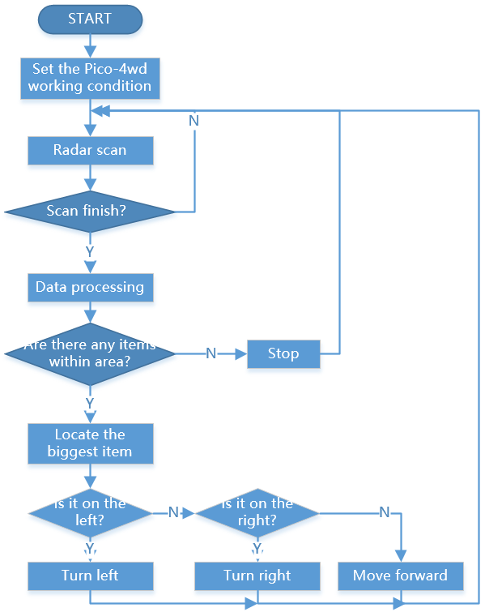

Follow Your Hand
==================

.. image:: img/example_follow.png

Here, Pico-4wd will follow your hand moving forward.

**How to do?**

#. Open the ``follow_hand.py`` file under the path of ``pico_4wd_car_main\examples``.

    .. image:: img/bull_fight1.png

#. Press ``Ctrl+Shift+S`` to save ``donot_push_me.py`` to the Raspberry Pi Pico as ``main.py``.

    .. image:: img/bull_fight2.png

#. Unplug the USB cable and turn on the power switch. When you put your hand in front of it, it will follow.

**How it works?**

