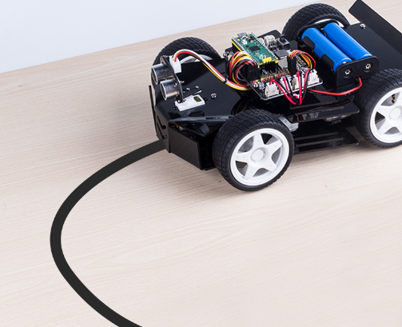
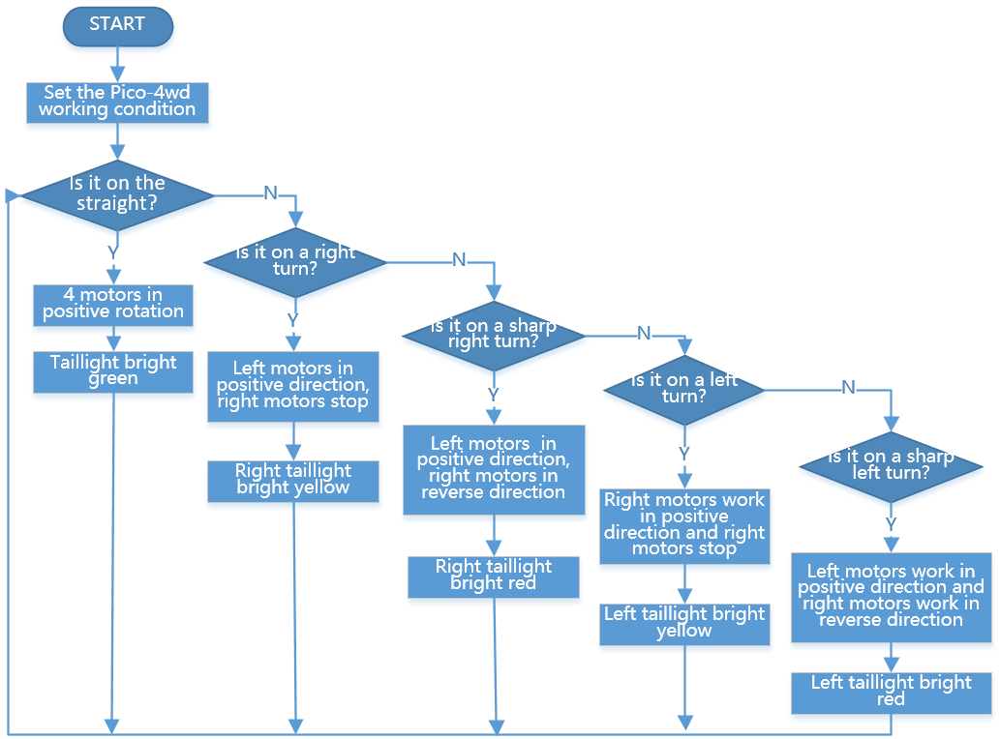

Line Track
===================

Let Pico-4wd walk on its exclusive avenue! Tape a line on a light-colored ground (or table) with black insulating tape. Run this script and you will see Pico-4wd track the line to forward.

.. warning::
    You should not have too small an angle when pasting the line so that the trolley cannot pass.

There are some little eggs in this script: when the Pico-4wd is going straight, the taillight (the RGB panel at the rear) will light up green; when turning, one side of the taillight will light up yellow.
In sharp turns, the taillight will light up red on one side.

**How to do?**

#. Open the ``line_track.py`` file under the path of ``pico_4wd_car_main\examples``.

    .. image:: img/line_track1.png

#. The following value should be modified based on the results of the :ref:`test_grayscale_module` section. It should be between the values of black and white surfaces. For example, in my tests, black surfaces generally around 3000 and white surfaces are around 20000, so 10000 is the appropriate threshold value. According to the actual situation, you can modify it to other values according to the actual situation.

    .. code-block:: Python

        car.GRAYSCALE_LINE_REFERENCE = 10000

#. Press ``Ctrl+Shift+S``, and then select **Raspberry Pi Pico** in the popup window that appears.

    .. image:: img/line_track2.png

#. Set the file name to ``main.py``. If you already have the ``main.py`` file in your Pico, it will prompt to overwrite the ``main.py`` file.

    .. image:: img/line_track3.png

#. Now you can unplug the USB cable, place the car on the taped track, turn on the power switch and it will track the line.

**How it Works?**

