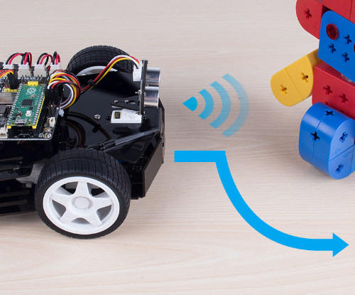

Obstacle Avoid
==========================

Let Pico-4wd do a challenging task: automatically avoid obstacles! When an obstacle is detected, instead of simply backing up, the radar scans the surrounding area and finds the widest way to move forward.

**How to do?**

#. Open the ``obstacle_avoid.py`` file under the path of ``pico_4wd_car_main\examples``.

    .. image:: img/obs_avoid1.png

#. Click **File** -> **Save as** or press ``Ctrl+Shift+S`` to save ``donot_push_me.py`` to the Raspberry Pi Pico as ``main.py``.

    .. image:: img/obs_avoid2.png

#. Unplug the USB cable and turn on the power switch. When you place it on the ground, it avoids the obstacles and keeps going.

**How it Works?**

.. image:: img/flowchart_obstacle_avoid.png
    :width: 800