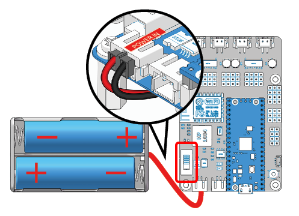

4. Test the Modules
==================================

This chapter is suitable for usability testing of the modules before assembly; or for final commissioning and maintenance of the Pico-4wd after assembly has been completed.

Power up the Pico RDP
-----------------------

In order to make the module work, you need to power up the Pico RDP and turn the power switch to ON.

Test the Motors
---------------------

#. Connect the 4 motors according to the diagram below.

    .. image:: img/wiring_test_motor.png
        :width: 800
        :align: center

#. Select Correct Interpreter

    Plug the Pico into your computer with a micro USB cable and select the "MicroPython (Raspberry Pi Pico).COMXX" interpreter in the bottom right corner.

    .. image:: img/sec_inter.png

#. Go to the ``pico_4wd_car_main/tests`` path and double click on ``test_motor.py`` to open it.

    .. image:: img/code_test_motor.png

#. Click the **Run current script** button or just press F5 to run it.

    .. image:: img/run_test_motor.png

Now, you can see the four motors work in a regular pattern. If you complete the assembly, this code will make the Pico-4wd perform five movements: forward, backward, left, right and stop.

Test the Ultrasonic Module
-----------------------------

#. Connect the ultrasonic module as shown below.

    .. image:: img/wiring_test_ultrasonic.png

#. Run the ``test_sonar.py`` file under the path ``pico_4wd_car_main/tests``.

    .. image:: img/run_test_sonar.png

After running the code, the distance of ultrasonic detection will be displayed in the Shell. If the distance changes when your hand is in front of the ultrasonic module, the module is working properly.

Test the RGB Boards
--------------------

#. As shown below, connect the 3 RGB boards.

    .. image:: img/wiring_test_rgb.png

#. Run the ``test_light.py`` file in ``pico_4wd_car_main/tests``.

    .. image:: img/run_test_light.png

After the code is run, the 24 LEDs (all on the 3 RGB boards) to emit red, green, blue and white light in turn.

.. _test_grayscale_module:

Test the Grayscale Sensor Module
---------------------------------

#. Diagrammatically connect the Grayscale Sensor Module.

    .. image:: img/wiring_test_3ch.png

#. Run the ``test_grayscale.py`` file in ``pico_4wd_car_main/tests``.

    .. image:: img/run_test_grayscale.png

    Upon running, you will see that the values in the Shell change when you place the grayscale module at a height of about 1cm above the different surfaces, indicating that it is working properly. 
    
    In general, the value for **white surfaces** > the value for **black surfaces** > the value for **overhanging** (grayscale module 10cm above the ground).

#. Because light intensities differ in different environments, the factory-set contrast may not be suitable for your current environment, which means the grayscale module cannot identify white and black lines well, so it needs to be calibrated.

    * Tape a small piece of black electrical tape to the ground or table.
    * Hold the grayscale module 1 cm above the table (this is about the same height as after assembly, so you can use it directly after calibration).
    *  Keep ``test_grayscale.py`` running, then use a screwdriver to adjust the potentiometer on the grayscale module until the values printed on the Shell are relatively far apart. Based on the actual situation, your values should differ from mine.

    .. image:: img/cali_gray.png

Test the Speed Module
------------------------

#. Follow the diagram below to connect the Speed Module.

    .. image:: img/wiring_test_speed.png

#. Run the ``test_speed.py`` file in ``pico_4wd_car_main/tests``.

    .. note::
        The Thonny IDE contains a line graph tool, please open it by clicking **View** > **Plotter** in the navigation bar to help you see how the printed values are changing.

    .. image:: img/run_test_speed.png

After the code runs, when you back and forth put the jammed paper into the U-shaped slot on the speed module/take it out.
The Shell in Thonny IDE will print the current speed.

If you have already mounted it, this code will make the Pico-4wd move forward at variable speed and print out the motor power (as a percentage) and the travel speed (cm/s). 
To use it you should hover the car so that the motor rotation is not obstructed.

.. _test_servo:

Test the Servo
--------------------------------------

#. Connect the servo according to the following diagram.

    .. image:: img/wiring_test_servo.png

#. Run the ``test_servo.py`` file in ``pico_4wd_car_main/tests``.

    .. image:: img/run_test_servo.png

Insert a rocker arm first to observe the rotation of the servo. After clicking on the Run button, the servo will rotate left and right once and then stop at 0°.

.. note::
    For the next chapter, :ref:`assemble_the_car`, the servo must be held at 0°, so after this code run, do not turn the servo shaft until the car is complete.
    
    In the event that you accidentally turn the servo shaft, remove the rocker arm, run this code again, and then reassemble the servo.

