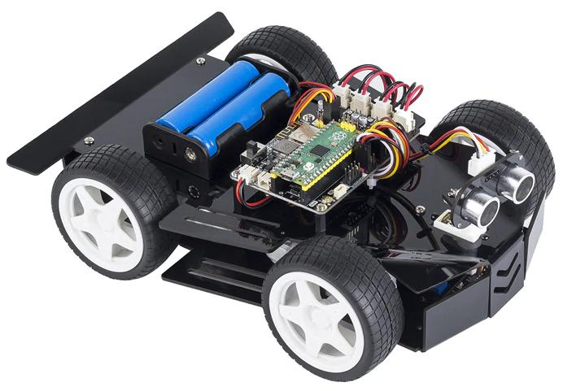

SunFounder Pico-4wd Car Kit
==========================================

The Pico-4wd is a Raspberry Pi Pico based, cool, robot car kit that everyone can have.

Equipped with greyscale sensor module and ultrasonic module, it can perform line tracking, cliff detection, follow and obstacle avoidance functions. The RGB boards assembled at the bottom and rear of the car make it the coolest spirit in the dark.

We have provided sample code based on MicroPython so you can get started quickly.

In addition, you can also use an app - SunFounder Controller - to DIY your own control methods! Let's Play!

Here is the Email: cs@sunfounder.com.

您想学习编程或拥有自己的编程机器人吗？如今，编程已经向低龄化发展，随着简单的图形化编程平台的普及，从micro:bit到Arduino和Raspberry Pi，这将成为每个人的趋势。

也许您以前没有听说过它们。但是，借助本产品和教程，您可以轻松安装一台多功能编程四驱麦克纳姆汽车，体验做创客的乐趣。
Raspberry pi pico 是一款高度集成的微控制器，功能强大，体积小。它非常适合应用在STEAM教育中，通过代码编程和图形化编程相结合的方式制作机器人、可穿戴设备和电子互动游戏。
这款 Keyestudio 4WD Mecanum Robot Car For Pico 是一款专用于 Raspberry Pi Pico 的智能 DIY 汽车。智能车由具有扩展功能的车身、集成电机驱动传感器的PCB底板、4个减速直流电机、麦克纳姆轮、RGB灯、各种传感器以及亚克力板组成。因此，您可以轻松自己组装出一辆炫酷的麦克纳姆轮四驱智能车。
我们为汽车制作了两个教程，一个是C语言使用Arduino IDE，另一个是MicroPython使用Thonny IDE，将带您享受安装和编程的乐趣。在这个过程中，不仅可以提升自己的制作能力，还可以学习编程的技巧。
Python 是最流行的编程语言之一，尤其是在机器学习领域，它的可用性和可访问性带来了巨大的便利。然而，MicroPython 致力于在微控制器和嵌入式系统中复兴 Python 编程语言，而 C 语言使我们能够获得更底层的代码。
这是一个 C 语言教程，用于 4WD Mecanum Robot Car For Pic，本教程中的代码是用 C/C++ 编写的。每个项目代码都有详细的解释，让你更容易理解。最后，如果您对本教程和工具包有任何困难或疑问，可以随时咨询我们。 

**特征**
该产品集成了七色灯、WS2812RGB LED、舵机、超声波、寻线、红外控制、蓝牙控制等多项功能。其中，七色灯、RGB2812 LED、电机驱动器、3通道寻线传感器、IR接收器（为了接收准确，我们会在头上各放一个，在尾部放一个）都集成在底座中板，使我们更容易安装。
更重要的是，4个WS2812RGB LED可以显示不同的颜色，2个七色灯可以为汽车制作方向灯。顺便说一句，该产品的电机速度是可调的。

本产品采用两节18650锂电池供电。安装和拆卸电池时，请注意电池的正负极，切勿接反。 
**参数**
连接器端口输入：DC 6V---9V
驱动板系统工作电压：5V
标准工作功耗：约3W
最大功率：14W
电机转速：200RPM
工作温度范围：0-50℃
外形尺寸： 134*181*75mm
环保属性：ROHS

**About the display language**

In addition to English, we are working on other languages for this course. Please contact service@sunfounder.com if you are interested in helping, and we will give you a free product in return. 
In the meantime, we recommend using Google Translate to convert English to the language you want to see.

The steps are as follows.

* In this course page, right-click and select **Translate to xx**. If the current language is not what you want, you can change it later.

.. image:: img/translate1.png
    :align: center

* There will be a language popup in the upper right corner. Click on the menu button to **choose another language**.

.. image:: img/translate2.png
    :align: center

* Select the language from the inverted triangle box, and then click **Done**.

.. image:: img/translate3.png
    :align: center

**Source Code**

:download:`SunFounder Pico-4wd Car Code <https://github.com/sunfounder/pico_4wd_car/archive/refs/heads/main.zip>`

Or check out the code at |link_pico_4wd_github|

.. toctree::
    :maxdepth: 2

    assemble_the_car
    play_mode
    programming_mode
    appendix/appendix
    faq
    thank-robot

Copyright Notice
--------------------------

All contents including but not limited to texts, images, and code in this manual are owned by the SunFounder Company. You should only use it for personal study,investigation, enjoyment, or other non-commercial or nonprofit purposes, under therelated regulations and copyrights laws, without infringing the legal rights of the author and relevant right holders. For any individual or organization that uses these for commercial profit without permission, the Company reserves the right to take legal action.

   