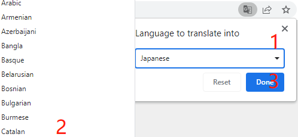

SunFounder Pico 4WD Car V2.0 Kit
==========================================

.. image:: img/pico_4wd_v2.png
    :align: center
    :width: 600

Do you want to learn to program or have your own programming robot? The market is filled with a wide variety of robots, some of which use the micro:bit platform, others use Arduino or Raspberry Pi platforms. If you're not sure what to select and where to begin, then our Pico 4WD car can help you begin your journey of discovery.

This car uses the Raspberry Pi Pico, a powerful small microcontroller introduced by Raspberry Pi in recent years, which can be used to learn MicroPython, Arduino or graphical programming language.

A simple structure and full functionality make the Pico 4WD car a perfect choice for your needs. There are a variety of features on it, including remote control, line tracking, cliff detection, obstacle avoidance, object following, and more.

Additionally, it features 24-bit WS2812 RGB LEDs that can be used as directional indicators or as cool lighting effects.

For quick play, we have uploaded libraries and scripts at the factory, which you just need to assemble, then you can controlling it with your smartphone.

One point that must be mentioned is that the car is equipped with a rechargeable battery, which can be charged directly through the expansion board.

**Features**

* Main Board: Raspberry Pi Pico, Pico RDP(Robotics Development Platform)
* Programming Software: Thonny
* Programming Language: MicroPython
* Input: Ultrasonic module, Grayscale module, Speed module
* Output: Motor, WS2812 RGB Boards, Servo, 
* Voltage: 6.6V~8.4V
* Battery life: 90min
* Battery charge time: 130min
* Functions: Remote Control, Obstacle Avoidance, Object Following, Line Track, Cliff Detection, Speech Control
* WiFi: ESP01s
* Remote Control: APP - SunFounder Controller
* Size: 9.45'' x 6.69'' x 3.94'' (240mm x 170mm x 100mm(LxWxH))

Here is the Email: cs@sunfounder.com.

**About the display language**

In addition to English, we are working on other languages for this course. Please contact service@sunfounder.com if you are interested in helping, and we will give you a free product in return. 
In the meantime, we recommend using Google Translate to convert English to the language you want to see.

The steps are as follows.

* In this course page, right-click and select **Translate to xx**. If the current language is not what you want, you can change it later.

.. image:: img/translate1.png
    :align: center

* There will be a language popup in the upper right corner. Click on the menu button to **choose another language**.

.. image:: img/translate2.png
    :align: center

* Select the language from the inverted triangle box, and then click **Done**.

**Source Code**

:download:`SunFounder Pico-4wd Car Code <https://github.com/sunfounder/pico_4wd_car/archive/refs/heads/v2.0.zip>`

Or check out the code at |link_pico_4wd_github|

.. toctree::
    :maxdepth: 2

    assemble_the_car
    play_mode
    programming_mode
    appendix/appendix
    faq
    thank-robot

Copyright Notice
--------------------------

All contents including but not limited to texts, images, and code in this manual are owned by the SunFounder Company. You should only use it for personal study,investigation, enjoyment, or other non-commercial or nonprofit purposes, under therelated regulations and copyrights laws, without infringing the legal rights of the author and relevant right holders. For any individual or organization that uses these for commercial profit without permission, the Company reserves the right to take legal action.

   