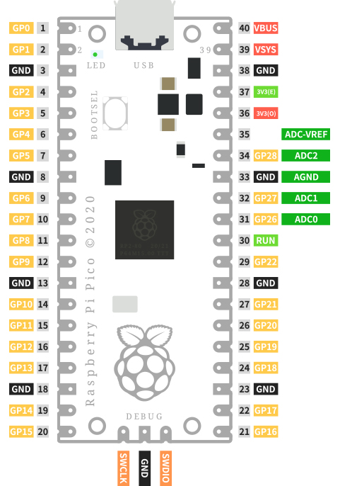

Introduction to Raspberry Pi Pico
===================================

.. image:: img/pico.jpg
    :width: 400
    :align: center

The Raspberry Pi Pico is a microcontroller board based on the Raspberry Pi RP2040 microcontroller chip.

Whether you want to learn the MicroPython programming language, take the first step in physical computing, or want to build a hardware project, Raspberry Pi Pico – 
and its amazing community – will support you every step of the way. In the project, it can control anything, from LEDs and buttons to sensors, motors, and even other microcontrollers.

Features
--------------

* 21 mm × 51 mm form factor
* RP2040 microcontroller chip designed by Raspberry Pi in the UK
* Dual-core Arm Cortex-M0+ processor, flexible clock running up to 133 MHz
* 264KB on-chip SRAM
* 2MB on-board QSPI Flash
* 26 multifunction GPIO pins, including 3 analog inputs
* 2 × UART, 2 × SPI controllers, 2 × I2C controllers, 16 × PWM channels
* 1 × USB 1.1 controller and PHY, with host and device support
* 8 × Programmable I/O (PIO) state machines for custom peripheral support
* Supported input power 1.8–5.5V DC
* Operating temperature -20°C to +85°C
* Castellated module allows soldering direct to carrier boards
* Drag-and-drop programming using mass storage over USB
* Low-power sleep and dormant modes
* Accurate on-chip clock
* Temperature sensor
* Accelerated integer and floating-point libraries on-chip

Pico's Pins
------------

.. list-table::
    :widths: 3 5 10
    :header-rows: 1

    *   - Name
        - Description
        - Function
    *   - GP0-GP28
        - General-purpose input/output pins
        - Act as either input or output and have no fixed purpose of their own
    *   - GND
        - 0 volts ground
        - Several GND pins around Pico to make wiring easier.
    *   - RUN
        - Enables or diables your Pico
        - Start and stop your Pico from another microcontroller.
    *   - GPxx_ADCx
        - General-purpose input/output or analog input
        - Used as an analog input as well as a digital input or output – but not both at the same time.
    *   - ADC_VREF
        - Analog-to-digital converter (ADC) voltage reference
        - A special input pin which sets a reference voltage for any analog inputs.
    *   - AGND
        - Analog-to-digital converter (ADC) 0 volts ground
        - A special ground connection for use with the ADC_VREF pin.
    *   - 3V3(O)
        - 3.3 volts power
        - A source of 3.3V power, the same voltage your Pico runs at internally, generated from the VSYS input.
    *   - 3v3(E)
        - Enables or disables the power
        - Switch on or off the 3V3(O) power, can also switches your Pico off.
    *   - VSYS
        - 2-5 volts power
        - A pin directly connected to your Pico’s internal power supply, which cannot be switched off without also switching Pico off.
    *   - VBUS
        - 5 volts power
        - A source of 5 V power taken from your Pico’s micro USB port, and used to power hardware which needs more than 3.3 V.

The best place to find everything you need to get started with your `Raspberry Pi Pico <https://www.raspberrypi.com/documentation/microcontrollers/raspberry-pi-pico.html>`_.

Or you can click on the links below: 

* `Raspberry Pi Pico product brief <https://datasheets.raspberrypi.org/pico/pico-product-brief.pdf>`_
* `Raspberry Pi Pico datasheet <https://datasheets.raspberrypi.org/pico/pico-datasheet.pdf>`_
* `Getting started with Raspberry Pi Pico: C/C++ development <https://datasheets.raspberrypi.org/pico/getting-started-with-pico.pdf>`_
* `Raspberry Pi Pico C/C++ SDK <https://datasheets.raspberrypi.org/pico/raspberry-pi-pico-c-sdk.pdf>`_
* `API-level Doxygen documentation for the Raspberry Pi Pico C/C++ SDK <https://raspberrypi.github.io/pico-sdk-doxygen/>`_
* `Raspberry Pi Pico Python SDK <https://datasheets.raspberrypi.org/pico/raspberry-pi-pico-python-sdk.pdf>`_
* `Raspberry Pi RP2040 datasheet <https://datasheets.raspberrypi.org/rp2040/rp2040-datasheet.pdf>`_
* `Hardware design with RP2040 <https://datasheets.raspberrypi.org/rp2040/hardware-design-with-rp2040.pdf>`_
* `Raspberry Pi Pico design files <https://datasheets.raspberrypi.org/pico/RPi-Pico-R3-PUBLIC-20200119.zip>`_
* `Raspberry Pi Pico STEP file <https://datasheets.raspberrypi.org/pico/Pico-R3-step.zip>`_

Introduction to Pico RDP
===================================

Pico Robot Development Platform (RDP) is a Wi-Fi expansion module supporting Raspberry Pi Pico with Espressif's ESP8266 module.

It integrates industry-leading Wi-Fi solution, rich peripheral interfaces, and supports multiple compilers for development.

It also has IO expansion interface circuit, LED power indicator circuit, voltage measurement circuit and 4-channel DC motor driver circuit on board.

When you use Pico RDP for development and debugging, you can connect peripherals as you need, and the rich external interfaces can make your project more interesting.

Features
------------------

* Microcontroller: Raspberry Pi Pico module
* Wi-Fi: ESP8266 Wi-Fi module, 802.11 b/g/n (802.11n, speeds up to 150 Mbps), 2.4 GHz ~ 2.5 GHz frequency range
* RUN button: reset button
* Input voltage: 7.0-30.0V (PH2.0-2P)
* Output voltage: 7.0-30.0V (PH2.0-2P), 5.0V, 3.3V
* Output current: 5V/5A, 3.3V/1A
* One channel SH1.0-4P port: I2C port.
* Four channel XH2.54-4P port: DC motor port
* 12 x PWM channel, 3 x ADC channel, 4 x GPIO pins.
* One channel SH1.0-4P port: I2C port. Compatible with QwIIC and STEMMA QT

Pico RDP's Pins
------------------------

.. image:: img/pico_drp_pin.png

Here is the schematic of the Pico RDP: :download:`PDF Pico RDP Schematic <https://github.com/sunfounder/sf-pdf/raw/master/schematic/pico-rdp.pdf>`.
