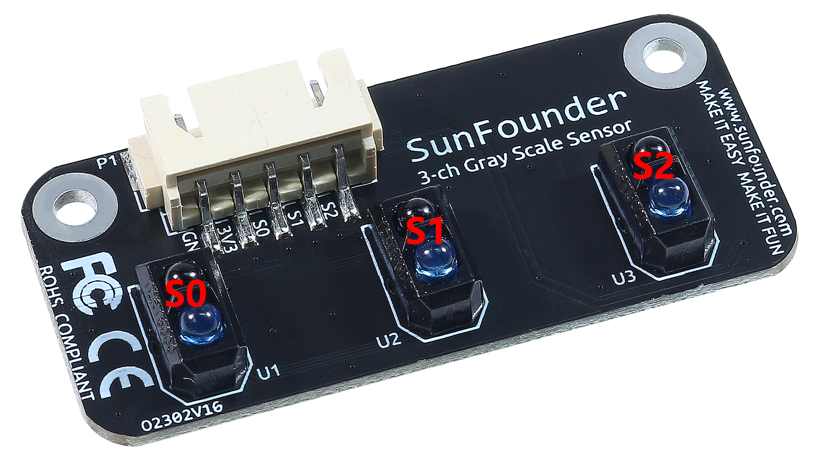
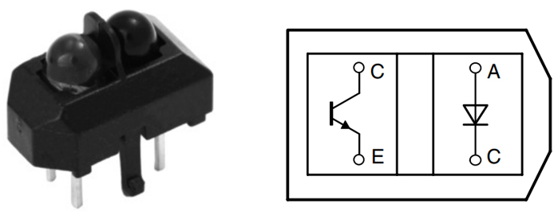
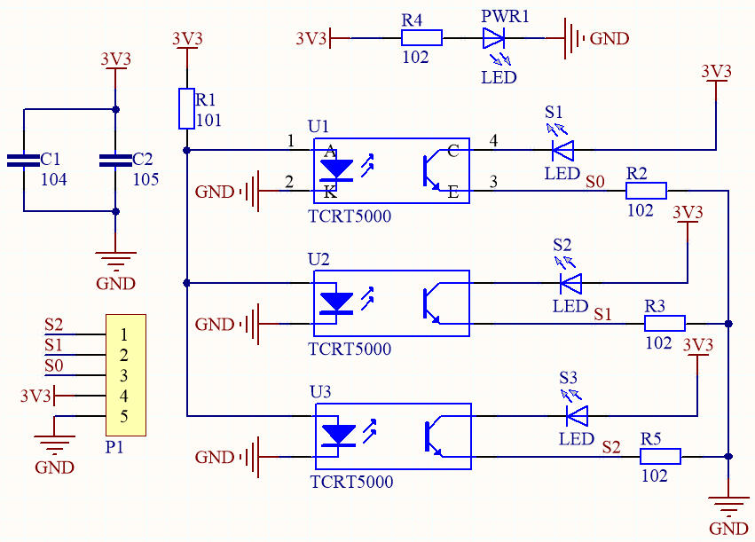

.. _cpn_grayscale:

1. Introduce Grayscale Module
=======================================

* **GND**: Ground Input
* **3V3**: 3.3 to 5V DC Supply Input
* **S0/S1/S2**: The output values of the three TCRT5000 transmitting sensors, the outputs are analog values.

This is a grayscale sensor module consisting of 3 |link_tcrt5000_datasheet| transmitting sensors, which can be used for line following and edge detection.

The |link_tcrt5000_datasheet| transmitter sensor consists of an infrared light-emitting diode and a phototransistor covered with a lead material to block visible light.

When working, the IR LED of TCRT5000 continuously emits infrared light (invisible light) with a wavelength of 950nm. When the emitted infrared light is not reflected back by the obstacle or the reflection intensity is insufficient, the phototransistor does not work. 
When the infrared light is reflected with sufficient intensity and received by the phototransistor at the same time, the phototransistor is in working condition and provides output.

**Schematic Diagram**

Here is the schematic of the module

* When working, the IR LED of TCRT5000 continuously emits infrared light (invisible light) with a wavelength of 950nm. 
* When the infrared light is reflected, the phototransistor is in working condition and output analog value.
* In general, white surface return value > black surface's > cliff's.
* Also the brighter the surface, the more reflections, resulting in an increase in current, the brighter the LED.

**Features**

* 3 Channels
* Operating Voltage: 3.3 ~ 5V
* Output: analog value
* Sensor Type：TCRT5000
* Connector Model：XH2.54-WS-5P
* Operating Temperature: -10 °C to +50 °C
* Dimensions: 50mm x 25mm