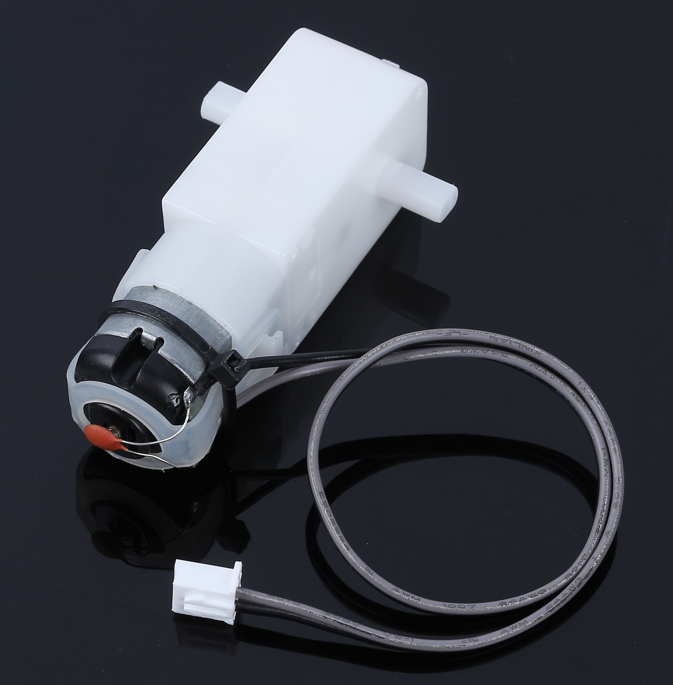
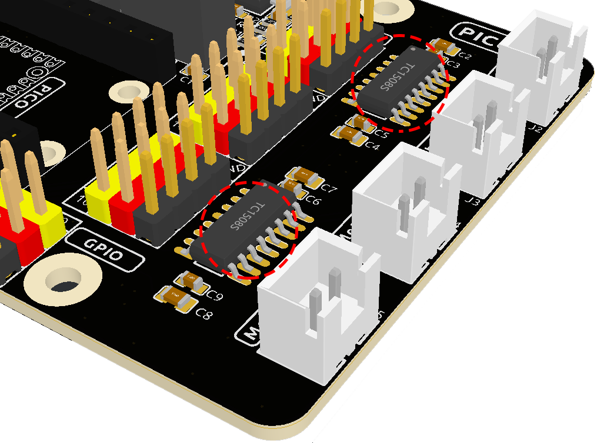
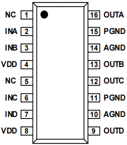
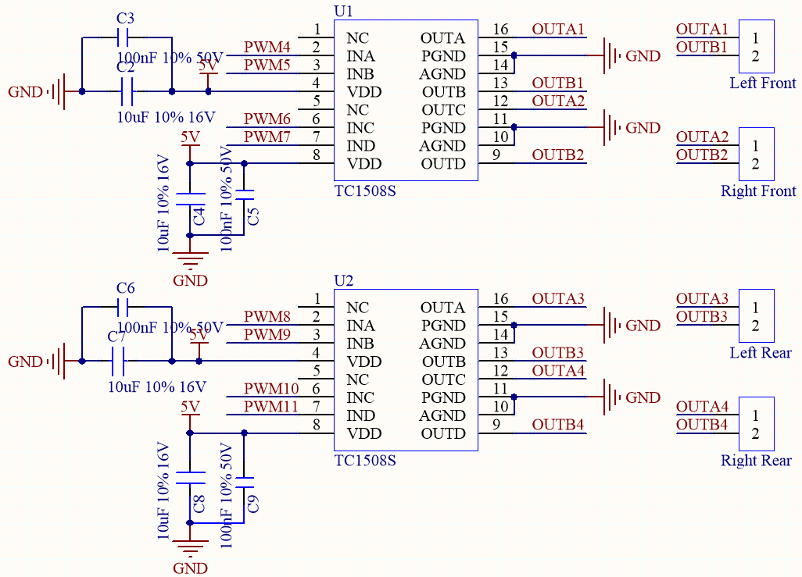
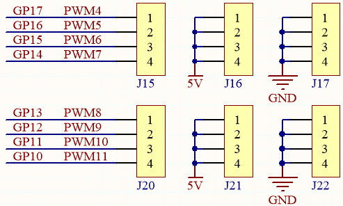
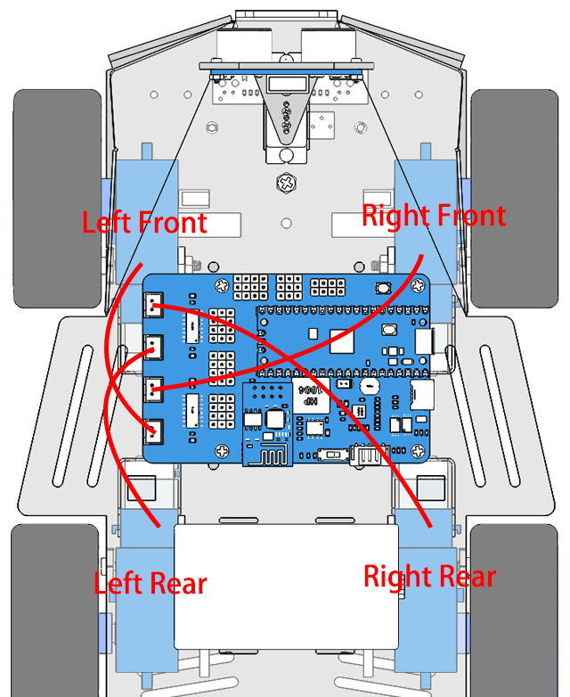

.. _cpn_tt_motor:

1. Introduce the Motor
=============================

* Rated Voltage: 3~6V
* Continuous No-Load Current: 150mA +/- 10%
* Min. Operating Speed (3V): 90+/- 10% RPM
* Min. Operating Speed (6V): 200+/- 10% RPM
* Stall Torque (3V): 0.4kg.cm
* Stall Torque (6V): 0.8kg.cm
* Gear Ratio: 1:48
* Body Dimensions: 70 x 22.3 x 36.9mm
* Wires: Gray and Black, 24AWG, 250mm
* Connector: XH2.54-2P
* Weight: 30.6g

This kit comes with 4 TT Motors, which are ordinary DC motors with matching gearboxes to provide low speed but high torque. This motor has a gear ratio of 1:48 and comes with 2 x 250mm wires with XH2.54-2P connector.

When the motor is powered, it rotates in one direction. Invert the polarity of the power supply, and the motor will rotate the other way.

As this kind of motor requires a lot of current, using the main board's IO port directly may not work and may damage the board. Hence, a motor driver chip is required.

**TC1508S Chip**

The TC1508S is used in the Pico RDP (Robotics Development Platform), which can drive two motors at the same time with a wide operating voltage range of 2.2~5.5V and a maximum continuous output current of 1.8A.

Two TC1508S chips are used here to drive the four motors, and the corresponding schematic is shown below.

And the corresponding positions of the motors on the car are as follows.

So the corresponding control pins and rotation directions of the 4 motors are as follows.

.. list-table:: **Motor-Pin List**

    *   - **Motor**
        - **PinA**
        - **PinB**
    *   - Left Front
        - GP17
        - GP16
    *   - Right Front
        - GP15
        - GP14
    *   - Left Rear
        - GP13
        - GP12
    *   - Right Rear
        - GP11
        - GP10

.. list-table:: **Motor Work**

    *   - **PinA**
        - **PinB**
        - **Work**
    *   - H
        - L
        - Rotate Clockwise(CW)
    *   - L
        - H
        - Rotate Counter-clockwise(CCW)
    *   - H
        - H
        - Stop
