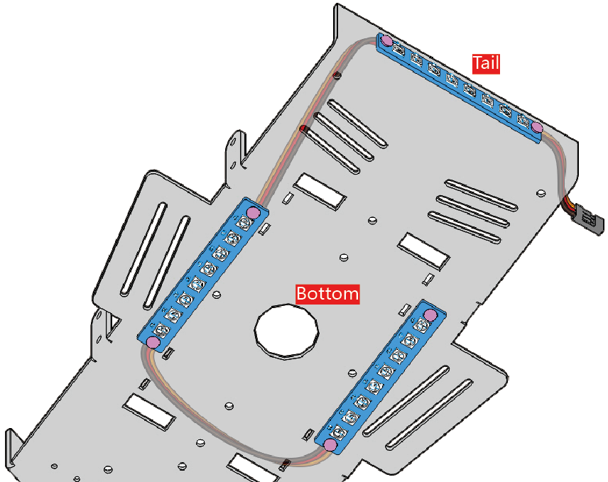

1. Introduce the RGB Boards
=======================================

* **DO**: Control data signal output
* **DI**: Control data signal input
* **5V**: 5V DC Supply Input
* **GND**: Ground input

In this kit, there are 3 RGB Boards, each with 8 WS2812B, which can be used for cool light effect display or direction indication.

**Features**

* Work Voltage: +3.5 ~ +5.3
* RGB Type：WS2812B
* Color: Full color
* Port: SH1.0-3P
* Demension: 71mm x 11mm
* Working Temperature: -25 ~ 80

**WS2812B**

The WS2812B (|link_ws2812b_datasheet|) is a intelligent control LED light source that the control circuit and RGB chip are integrated in a package of 5050 components. 

The **DIN** pin receive data from controller, the first WS2812B collect initial 24bit data then sent to the internal data latch, the other data which reshaping by the internal signal reshaping amplification circuit sent to the next cascade WS2812B through the **DO** pin.

**Schematic Diagram**

Here is the schematic of the RGB Board (4 WS2812B's are shown here, 8 in total)

.. image:: img/sch_rgb_board.png
    :width: 800

**Data Transfer**

As shown in the diagram below, the 24 bit data is passed from the tail RGB board to the bottom left RGB board, then to the bottom right RGB board when programming.

