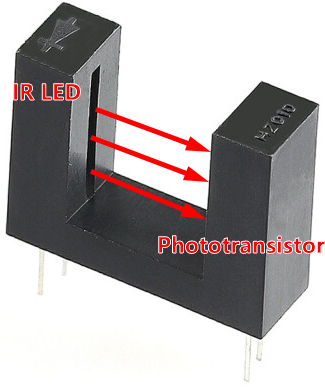

.. _cpn_speed:

1. Introduce Speed Module
=====================================

.. image:: img/2ch_speed_module.png
    :width: 500
    :align: center

* **GND**: Ground Input
* **3V3**: 3.3 to 5V DC Supply Input
* **1Y and 2Y**: The output values of the 2 H2010 photoelectric sensors. Output 0 when blocked, otherwise output 1.

This is a module composed of 2 H2010 photoelectric sensors that can be used with an encoder disk to calculate the motor's rotation speed.

The encoder disk is a black plastic disk with 20 evenly spaced slots in the middle.

The use of all three of them is shown in the figure below. A disk encoder is inserted into a motor shaft, and the motor rotates with it as it passes across the middle of the speed sensor.

When the infrared ray emitted by the light-emitting diode of the speed module is blocked, a low level will be output; when the emitted infrared ray passes through the slot of the encoder disk, a high level will be output.

The motor generates 20 high levels in one revolution. By counting the number of high levels obtained per minute and dividing by 20, the speed of the motor is obtained.

**Working Principle**

**H2010**

Speed module has two H2010 photoelectric sensors, each made up of a phototransistor and an infrared light emitter encased in a 10cm-wide black plastic case.

When operating, the infrared light-emitting diode continuously emits infrared light (invisible light), and the photosensitive triode will conduct if it receives it.

When it is connected to the circuit, the value of 1A and 2A is low when the phototransistor is conducting. If there is an object blocking the slot, 1A and 2A are high.

**sn74lvc2g14dbvr**

Then connect 1A and 2A to the inputs of the SN74LVC2G14 (|link_sn74lvc2g14dbvr_datasheet|). The SN74LVC2G14 is a dual schmitt trigger inverter, which is used here to boost and invert the signal and then output it.

The output values 1Y and 2Y will be output directly and determine the two indicator light states.

* **Summary**: When the H2010 photoelectric sensor on the speed module is blocked, the corresponding channel will output a low level and the indicator will light up. And vice versa.

**Features**

* Operating Voltage: 3.3V ~ 5V DC
* Output format: Digital switching output (Output 0 when blocked, otherwise output 1)
* LED lights when it when blocked.
* PCB Size: 64x24x23mm
* Operating Current: 15mA
* 10mm wide slot with 12mm height detects objects via infrared light between its slot
* Fast output update since its optical

