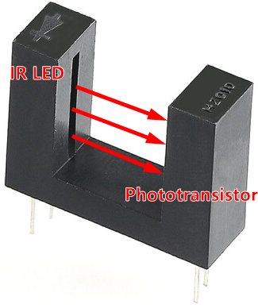

2. Speed Calculation
========================

As described in :ref:`cpn_speed`, the speed module's speed measurement principle is to count the number of times the infrared light pass through the encode disk per unit time.

.. note::
    Before running the following scripts, it is recommended to hang the car in the air so that the 4 wheels can turn freely.

**1. Counting** (``speed_2.1_count.py``)

    Let's count how many times the infrared rays pass through the encode disk in a minute.

    .. code-block:: python

        from machine import Timer, Pin

        def on_left(ch):
            global left_count
            left_count += 1

        def on_timer(ch):
            global left_count
            print(left_count)
            left_count = 0

        # Interrupter, used to count
        left_count = 0
        left_pin = Pin(8, Pin.IN, Pin.PULL_UP)
        left_pin.irq(trigger=Pin.IRQ_FALLING, handler=on_left)

        # Timer, print count every 1000ms
        tim = Timer()
        tim.init(period=1000, mode=Timer.PERIODIC, callback=on_timer)

        # motor run
        import motors
        import time

        try:
            while True:
        #         for i in range(20,100,10):
                motors.move("forward",50)
        #             time.sleep(1)
        finally:
            motors.stop()
            time.sleep(0.2)

    Copy the above code into Thonny or open the ``speed_2.1_count.py`` under the path of ``pico_4wd_car-v2.0\examples``. Then click the |thonny_run| button or press ``F5`` to run it.

    After powering up the Pico 4WD car, you will see the 4 motors turning (forward) while seeing the count in the Shell.

**2. Calculate the RPM** (``speed_2.2_rpm.py``)

    Now let's calculate the RPM based on the counts. To improve the accuracy of the calculation, the calculation period is set to 200ms.

    .. code-block:: python
        :emphasize-lines: 2,4,13,14,15,27

        from machine import Timer, Pin
        import math

        duration = 200

        def on_left(ch):
            global left_count
            left_count += 1

        def on_timer(ch):
            global left_count
            # revolutions per second
            times = left_count * 1000 /duration 
            rps=times/20.0
            print(rps)

            # clear count
            left_count = 0

        # Interrupter, used to count        
        left_count = 0
        left_pin = Pin(8, Pin.IN, Pin.PULL_UP)
        left_pin.irq(trigger=Pin.IRQ_FALLING, handler=on_left)

        # Timer, print speed
        tim = Timer()
        tim.init(period=duration, mode=Timer.PERIODIC, callback=on_timer)

        # motor run
        import motors
        import time

        try:
            while True:
                for i in range(20,100,10):
                    motors.move("forward",i)
                    time.sleep(1)
        finally:
            motors.stop()
            time.sleep(0.2) 

    After running the script, click **View** -> **Plotter** to view the RPM curve, and you can see that the higher the power, the faster the RPM.

**3. Calculate moving speed** (``speed_2.3_move_speed.py``)

    Next, the RPM is converted to moving speed (unit:cm/s). Here the moving speed is actually the RPM multiplied by the circumference of the wheel.

    .. code-block:: python
        :emphasize-lines: 4,14,16,17

        from machine import Timer, Pin
        import math

        WP = 2 * math.pi * 3.3 # wheel_perimeter(cm): 2 * pi * r
        duration = 200

        def on_left(ch):
            global left_count
            left_count += 1

        def on_timer(ch):
            global left_count
            # revolutions per second
            rps = left_count * 1000 /duration /20.0
            # speed
            speed = rps * WP
            print(speed)
            # clear count
            left_count = 0

        # Interrupter, used to count        
        left_count = 0
        left_pin = Pin(8, Pin.IN, Pin.PULL_UP)
        left_pin.irq(trigger=Pin.IRQ_FALLING, handler=on_left)

        # Timer, print speed
        tim = Timer()
        tim.init(period=duration, mode=Timer.PERIODIC, callback=on_timer)

        # motor run
        import motors
        import time

        try:
            while True:
                for i in range(20,100,10):
                    motors.move("forward",i)
                    time.sleep(1)
        finally:
            motors.stop()
            time.sleep(0.2) 

**4. Calculate the speed on both sides** (``speed_2.4_2motor.py``)

In the case of a turn, there may be a situation where one side of the wheel is not rotating, but the car is actually moving. Then we can use both sides of the speed module to reduce error.

.. code-block:: python
    :emphasize-lines: 11,12,13,16,18,24,28,31,32

    from machine import Timer, Pin
    import math

    WP = 2 * math.pi * 3.3 # wheel_perimeter(cm): 2 * pi * r
    duration = 200

    def on_left(ch):
        global left_count
        left_count += 1

    def on_right(ch):
        global right_count
        right_count += 1

    def on_timer(ch):
        global left_count,right_count
        # revolutions per second
        rps = (left_count + right_count) * 1000 /duration /20.0 /2
        # speed
        speed = rps * WP
        print(speed)
        # clear count
        left_count = 0
        right_count = 0

    # Interrupter, used to count        
    left_count = 0
    right_count = 0
    left_pin = Pin(8, Pin.IN, Pin.PULL_UP)
    left_pin.irq(trigger=Pin.IRQ_FALLING, handler=on_left)
    right_pin = Pin(9, Pin.IN, Pin.PULL_UP)
    right_pin.irq(trigger=Pin.IRQ_FALLING, handler=on_right)

    # Timer, print speed
    tim = Timer()
    tim.init(period=duration, mode=Timer.PERIODIC, callback=on_timer)

    # motor run
    import motors
    import time

    try:
        while True:
            for i in range(20,100,10):
                motors.move("forward",i)
                time.sleep(1)
    finally:
        motors.stop()
        time.sleep(0.2) 