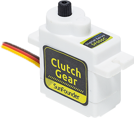
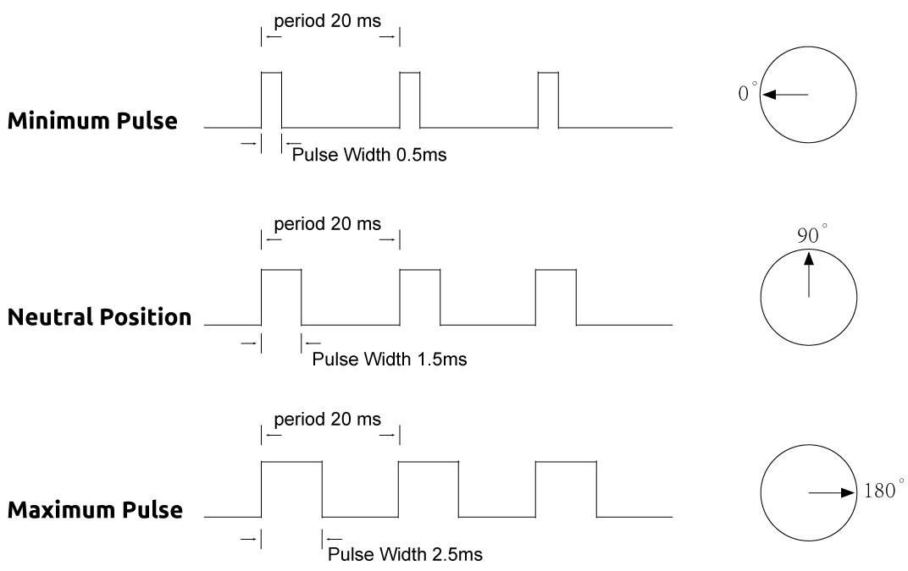

.. _cpn_servo:

1. Introduce Servo
========================

**What is a Servo？**

* Brown Line: GND
* Orange Line: Signal pin, connect to the PWM pin of main board.
* Red wire: VCC

The servo is a type of motor that can rotate very precisely. In most cases, servo motors feature a control circuit that provides feedback about the current position of the motor shaft, allowing the motor to rotate very precisely. If you want to rotate an object at some specific angle or distance, then you use a servo.

**Features**

* Name: SG90
* Size: 22.4 x 12.5 x 23.8mm
* Weight: 10g±5%
* Wire length: 25cm±1cm
* Working voltage: 4.8v-6v
* Blocking torque: 1.3kg.cm-1.6kg.cm
* No-load speed: 0.09sev/60°
* No-load current: 90mA
* Output shaft: 20T

**How it work?**

A servo is generally composed of the following parts: case, shaft, gear system, potentiometer, DC motor, and embedded board.  

It works like this:

    * The microcontroller sends out PWM signals to the servo, and then the embedded board in the servo receives the signals through the signal pin and controls the motor inside to turn. 
    * As a result, the motor drives the gear system and then motivates the shaft after deceleration. 
    * The shaft and potentiometer of the servo are connected together. 
    * When the shaft rotates, it drives the potentiometer, so the potentiometer outputs a voltage signal to the embedded board. 
    * Then the board determines the direction and speed of rotation based on the current position, so it can stop exactly at the right position as defined and hold there.

.. image:: img/servo_internal.png
    :align: center

**Work Pulse**

The angle is determined by the duration of a pulse that is applied to the control wire. This is called Pulse width Modulation. 

* The servo expects to see a pulse every 20 ms. The length of the pulse will determine how far the servo turns. 
* For example, a 1.5ms pulse will make the servo turn to the 90 degree position (neutral position).
* When a pulse is sent to a servo that is less than 1.5 ms, the servo rotates to a position and holds its output shaft some number of degrees counterclockwise from the neutral point.
* When the pulse is wider than 1.5 ms the opposite occurs. 
* The minimal width and the maximum width of pulse that will command the servo to turn to a valid position are functions of each servo.
*  Generally the pulse will be about 0.5 ms ~ 2.5 ms wide.

