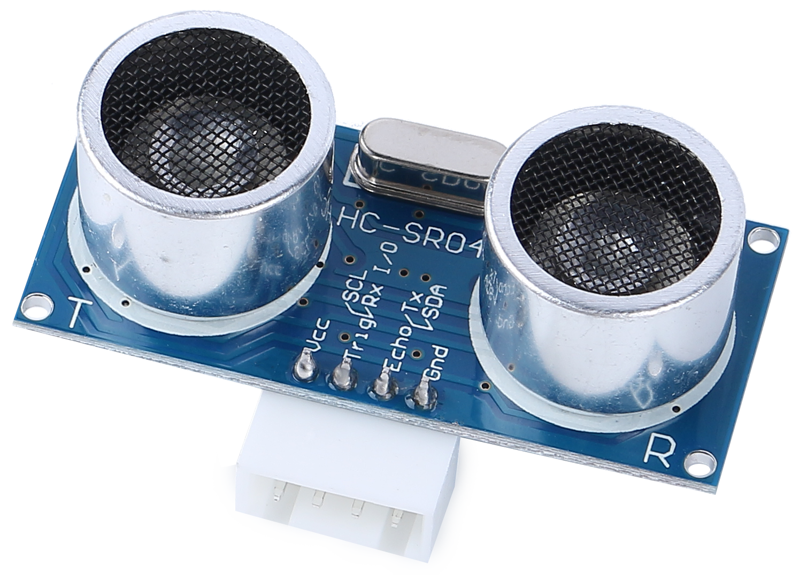

.. _cpn_ultrasonic:

4. Introduce Ultrasonic Module
================================

* **TRIG**: Trigger Pulse Input
* **ECHO**: Echo Pulse Output
* **GND**: Ground
* **VCC**: 5V Supply

This is the HC-SR04 ultrasonic distance sensor, providing non-contact measurement from 2 cm to 400 cm with a range accuracy of up to 3 mm. Included on the module is an ultrasonic transmitter, a receiver and a control circuit.

You only need to connect 4 pins: VCC (power), Trig (trigger), Echo (receive) and GND (ground) to make it easy to use for your measurement projects.

**Features**

* Working Voltage: DC5V
* Working Current: 16mA
* Working Frequency: 40Hz
* Max Range: 500cm
* Min Range: 2cm
* Trigger Input Signal: 10uS TTL pulse
* Echo Output Signal: Input TTL lever signal and the range in proportion
* Connector: XH2.54-4P
* Dimension: 46x20.5x15 mm

**Principle**

The basic principles are as follows:

* Using IO trigger for at least 10us high level signal.
* The module sends an 8 cycle burst of ultrasound at 40 kHz and detects whether a pulse signal is received.
* Echo will output a high level if a signal is returned; the duration of the high level is the time from emission to return.
* Distance = (high level time x velocity of sound (340M/S)) / 2

    .. image:: img/ultrasonic_prin.jpg
        :width: 800

Formula: 

* us / 58 = centimeters distance
* us / 148 = inch distance
* distance = high level time x velocity (340M/S) / 2

.. note::

  * This module should not be connected under power up, if necessary, let the module's GND be connected first. Otherwise, it will affect the work of the module.
  * The area of the object to be measured should be at least 0.5 square meters and as flat as possible. Otherwise, it will affect results.

