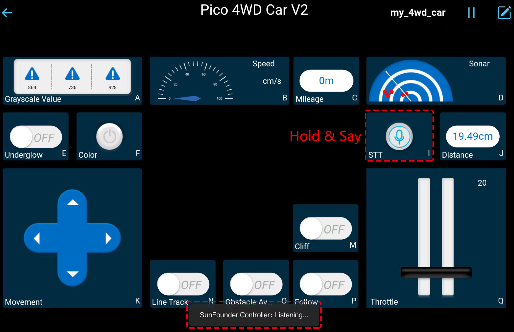

.. _play_mode:

2. Play Mode
======================

This Pico-4wd is shipped with the code pre-uploaded so that you can control it directly with the APP after powering up.

Here, the SunFounder self-developed App - SunFounder Controller is used. With this app, users can customize a controller to control their robot. It is compatible with Raspberry Pi, Raspberry Pi Pico/Pico W and Arduino boards.

Let's see how to control Pico 4WD car with this APP.

Quick User Guide
--------------------------

#. Install `SunFounder Controller <https://docs.sunfounder.com/projects/sf-controller/en/latest/>`_ from **APP Store(iOS)** or **Google Play(Android)**.

#. Let's start the Pico 4WD Car.

    * When first used or when the battery cable is unplugged, Pico RDP will activate its over-discharge protection circuitry(Unable to get power from battery).
    * Therefore, you'll need to plug in a Type-C cable for about 5 seconds to release the protection status.
    * At this time look at the battery indicators, if both battery indicators are off, please continue to plug in the Type-C cable to charge the battery.

        .. image:: img/pico_rdp_power.png

    .. note::
        Additionally, the LED on the ESP01S module will blink indicating that your mobile device is not connected.

#. Connect to ``my_4wd_car`` LAN.

    Your mobile device should now be connected to Pico 4WD Car's LAN so that they are on the same network.

    * Find ``my_4wd_car`` on the WLAN of the mobile phone (tablet), enter the password ``12345678`` and connect to it. 

        .. image:: img/seach_wifi.jpg

    * The default connection mode is AP mode. So after you connect, there will be a prompt telling you that there is no Internet access on this WLAN network, please choose to continue connecting.

        .. image:: img/connect_anyway.png

#. Create a controller.

    * Open SunFounder Controller and click on the **+** to create a new controller.

        .. image:: img/app_control13.png

    * We have preset controller for Pico-4wd, you can choose it directly.

        .. image:: img/choose_preset.png

    * Define a name for this Controller and click **Confirm**.

        .. image:: img/set_name.png

    * You are now inside the controller, which already has several widgets set up. Click the |app_save| button in the upper right corner.

        .. image:: img/click_save.png

#. Connect and run the Controller.

    * Now connect the SunFounder Controller to the Pico 4WD Car via the |app_connect| button to start communication.Wait a few seconds and ``my_4wd_car(IP)`` will appear, click on it to connect.

        .. image:: img/click_connect123.png

        .. note::
            You need to make sure that your mobile device is connected to the ``my_4wd_car`` LAN, if you are not seeing the above message for a long time.

    * After the "Connected Successfully" message appears and the product name will appear in the upper right corner.

    * At the same time, the LED on the ESP01S module will stop flashing.

        .. image:: img/esp01s_led.png

    * Now, click the |app_run| button to control your Pico 4WD Car with these widgets.

        .. image:: img/run_the_controller.png

#. Here are the functions of the widgets.

    * **Moving Related**

        * **Movement(K)**: Control the car to move back and forth, left and right.
        * **Throttle(Q)**: Set the power of the car to move.
        * **Cliff(M)**: Switch to cliff detection mode. As long as it's enabled, the car will stop automatically when it reaches the edge of a table or staircase when using the **Movement(K)** widget to move it. After you get it back to a safe area, you can control it to keep moving.

    * :ref:`app_rgb_board`
        * **Underglow(E)**: Turn on/off the bottom RGB Boards.
        * **Color(F)**: Switch to different colors. 

    * :ref:`app_stt`: Switching to STT(Speech to Text) mode.

    * :ref:`app_line_track`
        * **Grayscale Value(A)**: Shows the grayscale values detected by the Graycale module and status indication in three different environments.
        * **Line Track(N)**: Switching to line track mode.

    * :ref:`app_avoid and Follow`
        * **Sonar(D)**: Shows obstacles detected by Ultrasonic module.
        * **Distance(J)**：Shows the distance of obstacles.
        * **Obstacle Avoidance(O)**: Switching to obstacle avoidance mode.
        * **Follow(P)**: Switch to follow mode.

    * **Speed(B)**: Shows the speed of the car.
    * **Mileage(C)**:Shows the mileage of the car in motion.

    .. note::
        As shown in the figure, the four modes run at different priority levels and cannot be enabled together.

        .. image:: img/4_mode.png

.. _app_rgb_board:

RGB Boards Related
-------------------------

There are three 8-bit RGB Boards on the Pico 4WD Car, two at the bottom and one at the tail.

.. image:: img/3_rgb_board.png
    :width: 600

* **Underglow(E)** widget's function is to turn on or off bottom RGB boards.

* With the **Color(F)** widget, you can switch the color between 6 different colors: red, orange, yellow, green, blue, and purple.

By default, the RGB board at the tail lights up red when braking; while turning left or right, the two RGB LEDs on the left or right side light up orange.

.. _app_stt:

STT（I）
------------------------------

.. warning::
    Android devices cannot use the STT(Speech to Text) mode this time(AP Mode). Because the STT mode requires the Android mobile device to be connected to the Internet and to install the Google service component.
    
    While iOS devices use offline voice recognition engine, no network connection is required, AP and STA mode connection are both available.

    If you want to use the STT mode on your Android device, please refer to :ref:`stt_android`.

The Pico 4WD Car can also be controlled using STT in SunFounder Controller. Pico 4WD Car will perform the set actions based on the commands you say to your mobile device.

Now press and hold the **STT(I)** widget and say any of the following commands to see what happens.

* ``stop``: All movements of the car can be stopped.
* ``forward``: Let the car move forward.
* ``backward``：Let the car move backward.
* ``left``：Let the car turn left.
* ``right``：Let the car turn right.

.. _app_line_track:

Grayscale Module Related
--------------------------------

While this controller is running, **Grayscale Value(A)** will show the values of the three grayscale sensors in real time.

If you want to switch to Line Track mode (open the **Line Track(N)** widget), then you need to set the Line Track threshold and Grayscale threshold according to the current environment first, as follows.

#. Place the grayscale module in three environments: white, black and hanging in the air (10cm or more) to see how the data in the changes.

    **White surface**
        You will find that the value of the white surface is generally large, for example mine is around 240,000.

    .. image:: img/grayscale_white.png
        :width: 500
        :align: center

    **Black line**
        The value on the black line will be smaller, and now I'm at about 2000.

    .. image:: img/grayscale_black.png
        :width: 500
        :align: center

    **Overhang (10cm or more)**
        And the value of the overhang will be even smaller, already less than 1000 in my environment.

    .. image:: img/grayscale_cliff.png
        :width: 500
        :align: center

#. Set the threshold value.

    * My car reads around 24000 in the white area and around 2000 in the black line, so I set ``line_ref`` to about the middle value of ``10000``.
    * In the cliff area it reads less than 1000, so I set ``cliff_ref`` to ``1000``.

    * Now click the |app_edit| button to enter edit mode.

        .. image:: img/edit_controller.png

    * Click on the **Settings** button in the upper right corner of the **Grayscale Value(A)** widget.

        .. image:: img/set_grayscale.png

    * Fill in the cliff and line thresholds.

        .. image:: img/grayscale_refer.png

#. Now that the car and the app are set up, we need to use the electrical tape to stick a line to track.

    .. note::
        The line you stick must be at least 1cm wide and the bend angle should not be less than 90°.

    .. image:: img/map.png
        :width: 800

#. Place the Pico 4WD Car on your stickied line, open the **Line Track(N)** widget, and it will track the line.

    .. image:: img/line_track.gif

.. _app_avoid and Follow:

Ultrasonic Module Related
---------------------------------

**Obstacle Avoidance**

Turn on the **Obstacle Avoidance(O)** widget to switch to obstacle avoidance mode.

* The Pico 4WD car will keep moving forward and its ultrasonic sonar keeps turning.
* If an obstacle is detected in a certain direction, it will stop and detect it again from left to right.
* If it detects an obstacle on the left, it will turn to the right.
* If an obstacle is detected on the right, it will move to the left.
* It detects quickly, so you will find that it will detect as it goes until it is away from the obstacle, and then move forward.

    .. image:: img/avoid.gif

**Object Following**

Open **Follow(P)** widget to switch to follow mode.

* When you put your hand or other objects in front of the car at a distance of about 20cm, the car will follow your hand or object to move forward, turn left and turn right.
* Be careful not to move your hand or object too fast, and keep the distance within 20cm.

    .. image:: img/follow.gif

