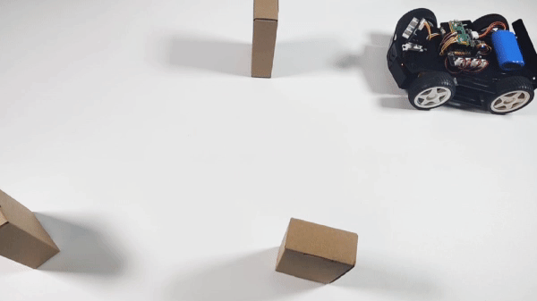

.. _py_avoid:

4. Obstacle Avoid
========================

Let Pico-4wd do a challenging task: automatically avoid obstacles! 
When an obstacle is detected, instead of simply backing up, 
the sonar scans the surrounding area and finds the widest way 
to move forward.

This project is an advanced version of the previous project :ref:`py_follow`. The previous project was to find the direction where the obstacle is, while here it is to find the direction where there is no obstacle.
To get a better understanding of this project, it is recommended that you finish the previous project first.

.. note::

    * The complete script ``project_4_avoid.py`` is in the path ``pico_4wd_car\examples\funny_projects``.

    * In order to allow the car to move on the ground without the USB cable connected, you need to save this script as ``main.py`` to Raspberry Pi Pico, see :ref:`run_script_offline` for a tutorial.

Below are the steps to implement the obstacle avoidance function, and you can copy them into Thonny to run them.

**1. Sonar scanning**

    * Let the car scan the area between -30° and 30° in front of it. Let the ultrasonic module read the values every 10° and then print out at once.
    * Then process the scan results. In contrast to the previous project, here the scan data is separated by ``0``, resulting in an area with no obstacles.
    * Data length is divided into left, middle, and right. Locate the center point of the region without obstacles and return ``"forward"`` if it is there.
    * If both have obstacles, then return ``"left"``.

    .. code-block:: python

        import sonar as sonar
        import motors as car
        import time

        def get_dir(data,split_str='0'):

            # get scan status of 0, 1
            data = [str(i) for i in data]
            data = "".join(data)

            # Split 0, leaves the free path
            paths = data.split(split_str)

            # Find the max path
            max_paths=max(paths)

            # If no wide enough path
            if len(max_paths)<2:
                return "left"

            # Calculate the direction of the widest one
            position = data.index(max_paths) # find the widest path position
            position += (len(max_paths)-1)/2 # find the middle of the widest path

            # Divide the scanning area into three pieces and mark the widest one
            if position < len(data) / 3:
                return "left"
            elif position > 2 * len(data) / 3:
                return "right"
            else:
                return "forward"

        try:
            sonar.set_sonar_scan_config(scan_range=60, step=10)
            sonar.set_sonar_reference(30)
            while True:
                _, _, sonar_data = sonar.sonar_scan()
                # sonar_data: 0 is block, 1 is pass
                time.sleep(0.04)

                # If sonar data return a int, means scan not finished, and the int is current angle status
                if isinstance(sonar_data, int):
                    continue # only list can go on

                direction = get_dir(sonar_data,split_str='0')
                print(sonar_data)
                print("The Car Should Go: ", direction)

        finally:
            pass

**2. Avoiding obstacles**

   * Move according to the result returned after processing. For example, if ``"left"`` is returned, make the car turn left.
   * While the car is turning, rotate the sonar scanner in the opposite direction until no obstacle is detected.
   * For example, if it is turning left, the sonar scanner will turn to the right.

    .. code-block:: python
        :emphasize-lines: 33,35,36,37,38,39,40,41,42,43,45,46,47,48,49,50,51,52,53,71

        import sonar as sonar
        import motors as car
        import time

        def get_dir(data,split_str='0'):

            # get scan status of 0, 1
            data = [str(i) for i in data]
            data = "".join(data)

            # Split 0, leaves the free path
            paths = data.split(split_str)

            # Find the max path
            max_paths=max(paths)

            # If no wide enough path
            if len(max_paths)<4:
                return "left"

            # Calculate the direction of the widest one
            position = data.index(max_paths) # find the widest path position
            position += (len(max_paths)-1)/2 # find the middle of the widest path

            # Divide the scanning area into three pieces and mark the widest one
            if position < len(data) / 3: 
                return "left"
            elif position > 2 * len(data) / 3:
                return "right"
            else:
                return "forward"

        def running(direction,power):
            if direction is "left":
                sonar.get_distance_at(20) # face right
                time.sleep(0.2)
                car.move("left", power*2)
                while True:
                    distance = sonar.get_distance_at(20) # face right
                    status = sonar.get_sonar_status(distance)
                    if status is 1: # right position is pass
                        break
                car.move("stop")
            elif direction is "right":
                sonar.get_distance_at(-20) # face left
                time.sleep(0.2)
                car.move("right", power*2)
                while True:
                    distance = sonar.get_distance_at(-20) # face left
                    status = sonar.get_sonar_status(distance)
                    if status is 1: # left position is pass
                        break
                car.move("stop")
            else:
                # pass
                car.move("forward",power)

        try:
            MOTOR_POWER = 30
            sonar.set_sonar_scan_config(scan_range=60, step=10)
            sonar.set_sonar_reference(30)
            while True:
                _, _, sonar_data = sonar.sonar_scan()
                # sonar_data: 0 is block, 1 is pass
                time.sleep(0.04)

                # If sonar data return a int, means scan not finished, and the int is current angle status
                if isinstance(sonar_data, int): 
                    continue # only list can go on
                direction = get_dir(sonar_data,split_str='0')
                running(direction, MOTOR_POWER)
                
        finally:
            car.move("stop")

**3. Reduce scanning angle**

    The car only needs to detect if there is an obstacle in front of it while moving forward. However, when it encounters an obstacle, it should stop and find a new route. Thus, the sonar scanner's search range should be changed from 60° to 180°.

    .. code-block:: python
        :emphasize-lines: 60,61,62,64,73,74,75,76,80,81

        import sonar as sonar
        import motors as car
        import time

        def get_dir(data,split_str='0'):

            # get scan status of 0, 1
            data = [str(i) for i in data]
            data = "".join(data)

            # Split 0, leaves the free path
            paths = data.split(split_str)

            # Find the max path
            max_paths=max(paths)

            # If no wide enough path
            if len(max_paths)<4:
                return "left"

            # Calculate the direction of the widest one
            position = data.index(max_paths) # find the widest path position
            position += (len(max_paths)-1)/2 # find the middle of the widest path

            # Divide the scanning area into three pieces and mark the widest one
            if position < len(data) / 3: 
                return "left"
            elif position > 2 * len(data) / 3:
                return "right"
            else:
                return "forward"

        def running(direction,power):
            if direction is "left":
                sonar.get_distance_at(20) # face right
                time.sleep(0.2)
                car.move("left", power*2)
                while True:
                    distance = sonar.get_distance_at(20) # face right
                    status = sonar.get_sonar_status(distance)
                    if status is 1: # right position is pass
                        break
                car.move("stop")
            elif direction is "right":
                sonar.get_distance_at(-20) # face left
                time.sleep(0.2)
                car.move("right", power*2)
                while True:
                    distance = sonar.get_distance_at(-20) # face left
                    status = sonar.get_sonar_status(distance)
                    if status is 1: # left position is pass
                        break
                car.move("stop")
            else:
                # pass
                car.move("forward",power)

        try:
            MOTOR_POWER = 30
            SCAN_RANGE_PASS = 60
            SCAN_RANGE_BLOCK = 180
            SCAN_STEP = 10
            status = "pass"
            sonar.set_sonar_scan_config(scan_range=SCAN_RANGE_PASS, step=SCAN_STEP)
            sonar.set_sonar_reference(30)
            while True:
                _, _, sonar_data = sonar.sonar_scan()
                # sonar_data: 0 is block, 1 is pass
                time.sleep(0.04)

                # If sonar data return a int, means scan not finished, and the int is current angle status
                if isinstance(sonar_data, int): 
                    if sonar_data is 0 and status is "pass": #If it finds an obstacle
                        status = "block"
                        car.move("stop") 
                        sonar.set_sonar_scan_config(SCAN_RANGE_BLOCK) # change scan range to 180 and re-scan
                    continue # only list can go on
                direction = get_dir(sonar_data,split_str='0')
                running(direction, MOTOR_POWER)
                status = "pass" # find a passable way
                sonar.set_sonar_scan_config(SCAN_RANGE_PASS) # change scan range to 60 for go forward
                
        finally:
            car.move("stop")
