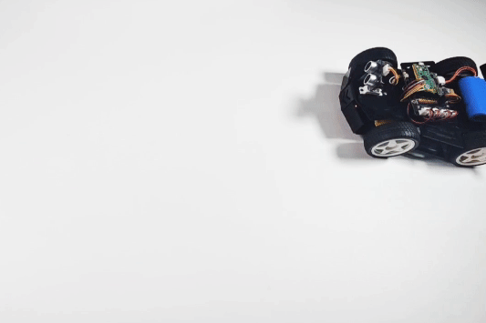

.. _py_follow:

3. Objects Follow
====================

In this project, Pico-4wd car will follow the object in front of it, for example, if you put your hand in front of it, it will rush towards your hand.

And it will also play the advantages of sonar scanning, will determine whether your hand is located in front of its left or directly in front, adjust its direction before moving forward.

.. note::

    * The complete script ``project_3_follow.py`` is in the path ``pico_4wd_car\examples\funny_projects``.

    * In order to allow the car to move on the ground without the USB cable connected, you need to save this script as ``main.py`` to Raspberry Pi Pico, see :ref:`run_script_offline` for a tutorial.

Below are the steps to implement the object follow function, and you can copy them into Thonny to run them.

**1. Sonar scanning**

    Let the car scan the area between -45° and 45° in front of it. Let the ultrasonic module read the values every 10° and then print out 10 sets of values at once.

        .. code-block:: python

            import sonar as sonar
            import motors as car
            import time

            try:
                sonar.set_sonar_scan_config(scan_range=90, step=10)
                while True:
                    _,_,sonar_data = sonar.sonar_scan()
                    # sonar_data: 0 is block, 1 is pass
                    time.sleep(0.04)

                    # If sonar data return a int, means scan not finished, and the int is current angle status
                    if isinstance(sonar_data,int):
                        continue # only list can go on

                    print(sonar_data)

            finally:
                pass

    * Run the script after copying it into Thonny.

    * After powering up the Pico 4WD car, you will see the array as shown below, ``0`` means that an obstacle has been detected.

        .. code-block:: python

            [0, 0, 1, 1, 0, 0, 0, 0, 1, 1]

**2. Divide the direction**

    Now to process the scan results. The scan range should be divided into three areas: left, middle and right. After that, determine where the center point of the largest obstacle is located, for example on the left, then let the car go to the left (here just show to the left, do not let the car move).

    Let the car stop if the obstacle is too small or there is no obstacle.

    .. code-block:: python
        :emphasize-lines: 5,49

        import sonar as sonar
        import motors as car
        import time

        def get_dir(data,split_str='0'):

            # get scan status of 0, 1
            data = [str(i) for i in data]
            data = "".join(data)
            print("Data: ",data)

            # Split 1, leaves the object path
            paths = data.split(split_str)
            print("Divide the Data: ", paths)

            # Find the max path
            max_paths=max(paths)
            print("Max Path: ",max_paths)

            # If no object
            if len(max_paths)<3:
                return "stop"

            # Calculate the direction of the biggest one
            position = data.index(max_paths) # find the biggest object position
            position += (len(max_paths)-1)/2 # find the middle of the biggest object
            print("Max Path's Direction: ",position)

            # Divide the scanning area into three pieces and mark the right one
            if position < len(data) / 3: 
                return "left"
            elif position > 2 * len(data) / 3:
                return "right"
            else:
                return "forward"

        try:
            sonar.set_sonar_scan_config(scan_range=90, step=10)
            while True:
                _,_,sonar_data = sonar.sonar_scan()
                # sonar_data: 0 is block, 1 is pass
                time.sleep(0.04)
                
                # If sonar data return a int, means scan not finished, and the int is current angle status
                if isinstance(sonar_data,int):
                    continue # only list can go on

                direction = get_dir(sonar_data,split_str='1')
                print("The Car Should Go: ", direction)

        finally:
            pass

    * Run the script after copying it into Thonny.
    * After powering up the Pico 4WD car, you will see the following data in the Shell. Now look at how this data is explained.

        .. code-block::

            Data:  0011000011
            Divide the Data:  ['00', '', '0000', '', '']
            Max Path:  0000
            Max Path's Direction:  5.5
            The Car Should Go:  forward

       * Separate the data ``0011000011`` with 1 as a separator to get the array ``['00', '', '0000', '', '']``.
       * The largest obstacle is ``'0000'``.
       * They are located in the fourth to seventh bits of the data (the first bit is the 0th bit), and that center point is at the 5.5 bit position.
       * Divide the length of the data (``0011000011``) into thirds. Since the length of this data set is 10, those less than 3.3 are on the left side and those greater than 6.6 are on the right side.
       * 5.5 is in the middle, then the car should be forward.

**3. Follow your hand**

    Make the Pico 4WD car move in the direction of the obstacle, for example, if there is an obstacle on the left, move to the left.

    .. code-block:: python
        :emphasize-lines: 31,54

        import sonar as sonar
        import motors as car
        import time

        def get_dir(data,split_str='0'):

            # get scan status of 0, 1
            data = [str(i) for i in data]
            data = "".join(data)

            # Split 1, leaves the object path
            paths = data.split(split_str)
            max_paths=max(paths)

            # no object
            if len(max_paths)<3:
                return "stop"

            # Calculate the direction of the biggest one
            position = data.index(max_paths) # find the biggest object position
            position += (len(max_paths)-1)/2 # find the middle of the biggest object

            # Divide the scanning area into three pieces and mark the right one
            if position < len(data) / 3: 
                return "left"
            elif position > 2 * len(data) / 3:
                return "right"
            else:
                return "forward"

        def running(direction,power):
            if direction == "left":
                car.move("left", power)
            elif direction == "right":
                car.move("right", power)
            elif direction == "forward":
                car.move("forward", power)
            else:
                car.move("stop")

        try:
            MOTOR_POWER = 20
            sonar.set_sonar_scan_config(scan_range=90, step=10)
            while True:
                _,_,sonar_data = sonar.sonar_scan()
                # sonar_data: 0 is block, 1 is pass
                time.sleep(0.04)
                
                # If sonar data return a int, means scan not finished, and the int is current angle status
                if isinstance(sonar_data,int):
                    continue # only list can go on

                direction = get_dir(sonar_data,split_str='1')
                running(direction,MOTOR_POWER)

        finally:
            car.move("stop")