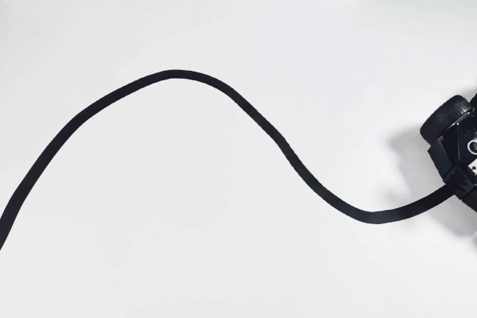

2. Line Track
===================

Let Pico-4wd walk its exclusive avenue! Use t'hethe black electrical tape to stick a line on a light-colored floor (or table). After running the script, you will see Pico-4wd tracking this line forward.

.. note::

    * The complete script ``project_2_line.py`` is in the path ``pico_4wd_car\examples\funny_projects``.

    * In order to allow the car to move on the ground without the USB cable connected, you need to save this script as ``main.py`` to Raspberry Pi Pico, see :ref:`run_script_offline` for a tutorial.

Below are the steps to implement the line track function, and you can copy them into Thonny to run them.

**1. Get line threshold**

    .. code-block:: python

        from grayscale import Grayscale
        import motors as car
        import lights
        import time

        # init grayscale module
        gs = Grayscale(26, 27, 28)
        gs.set_line_reference(10000)

        try:
            while True:
                print(gs.get_value())
                time.sleep(0.2)
        finally:
            pass

    * Run the script after copying it into Thonny.

    * After powering up the Pico 4WD car, place the grayscale module in following environments to see how the data in the Shell changes (keeping the USB cable connected to the computer).

        **White surface**
            You will find that the value of the white surface is generally large, for example mine is around 240,000.

        .. image:: img/grayscale_white.png
            :width: 500
            :align: center

        **Black line**
            The value on the black line will be smaller, and now I'm at about 2000.

        .. image:: img/grayscale_black.png
            :width: 500
            :align: center

    * My car reads around 24000 in the white area and around 2000 in the black line, so I set ``set_line_reference()`` to about the middle value of ``10000``.

**2. Tracking the line**

    * When the detected greyscale value of the corresponding channel is less than ``set_line_reference(10000)``, a ``1`` will be output, which means a black line is detected.
    * Then all three sets of data (``[0, 1, 0]``) will be output by ``get_line_status()``.
    * When the **middle** sensor detects a black line (value of 1), let the car go forward.
    * When the **middle** and **right** sensors detect the black line, the car turns right at a small angle
    * When the **right** sensor detects the black line, the car turns right at a large angle
    * Similarly, when the **left** and **middle** sensors detect the black line, the car will turn left at a small angle.
    * When the **left** sensor detects the black line, the car will turn left at a large angle

    .. code-block:: python

        from grayscale import Grayscale
        import motors as car
        import lights

        gs = Grayscale(26, 27, 28)
        gs.set_line_reference(10000)

        MOTOR_POWER = 30

        def line_track():
            while True:
                gs_data = gs.get_line_status()
                if gs_data == [0, 1, 0]:
                    car.set_motors_power([MOTOR_POWER, MOTOR_POWER, MOTOR_POWER, MOTOR_POWER])
                elif gs_data == [0, 1, 1]:
                    car.set_motors_power([MOTOR_POWER, 0, MOTOR_POWER, 0])
                elif gs_data == [0, 0, 1]:
                    car.set_motors_power([MOTOR_POWER, -MOTOR_POWER, MOTOR_POWER, -MOTOR_POWER])
                elif gs_data == [1, 1, 0]:
                    car.set_motors_power([0, MOTOR_POWER, 0, MOTOR_POWER])
                elif gs_data == [1, 0, 0]:
                    car.set_motors_power([-MOTOR_POWER, MOTOR_POWER, -MOTOR_POWER, MOTOR_POWER])

        try:
            line_track()
        finally:
            car.move("stop")

**3. Add light effects**

    Finally, while driving, let the two RGB Boards at the bottom light up according to the direction of the car moving.

    For example, when moving forward, the bottom two RGB Boards are lit in green. When turning right, let the right RGB Board light up, and when turning left, let the left RGB Board light up.
    
    .. code-block:: python

        from grayscale import Grayscale
        import motors as car
        import lights

        gs = Grayscale(26, 27, 28)
        gs.set_line_reference(10000)

        MOTOR_POWER = 30

        def line_track():
            while True:
                gs_data = gs.get_line_status()
                if gs_data == [0, 1, 0]:
                    car.set_motors_power([MOTOR_POWER, MOTOR_POWER, MOTOR_POWER, MOTOR_POWER])
                    lights.set_bottom_color([0, 100, 0])
                elif gs_data == [0, 1, 1]:
                    car.set_motors_power([MOTOR_POWER, 0, MOTOR_POWER, 0])
                    lights.set_off()
                    lights.set_bottom_left_color([50, 50, 0])
                elif gs_data == [0, 0, 1]:
                    car.set_motors_power([MOTOR_POWER, -MOTOR_POWER, MOTOR_POWER, -MOTOR_POWER])
                    lights.set_off()
                    lights.set_bottom_left_color([100, 5, 0])
                elif gs_data == [1, 1, 0]:
                    car.set_motors_power([0, MOTOR_POWER, 0, MOTOR_POWER])
                    lights.set_off()
                    lights.set_bottom_right_color([50, 50, 0])
                elif gs_data == [1, 0, 0]:
                    car.set_motors_power([-MOTOR_POWER, MOTOR_POWER, -MOTOR_POWER, MOTOR_POWER])
                    lights.set_off()
                    lights.set_bottom_right_color([100, 0, 0])

        try:
            line_track()
        finally:
            car.move("stop")
            lights.set_off()

