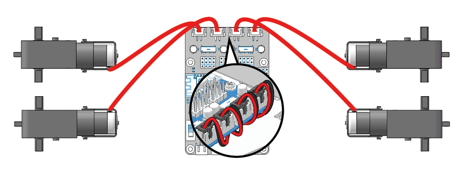
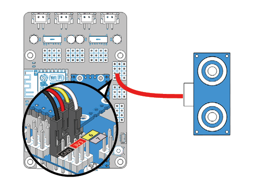
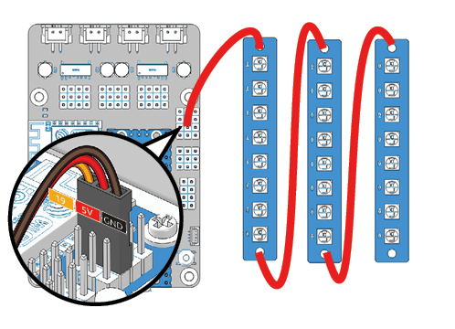
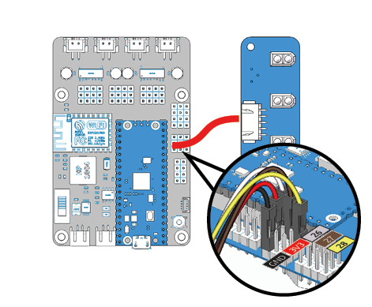
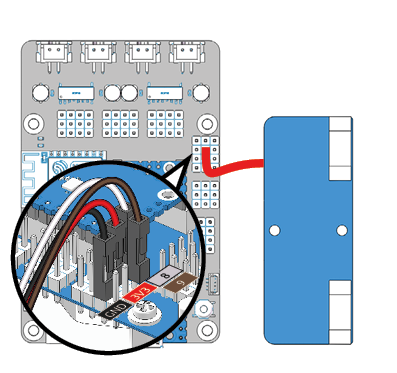
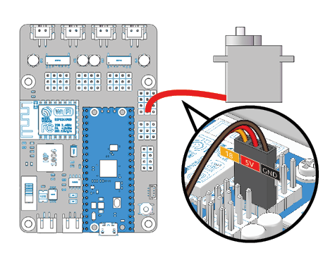

Test the Modules
==================================

This chapter is suitable for usability testing of the modules before assembly; or for final commissioning and maintenance of the Pico-4wd after assembly has been completed.

Make sure you have completed the settings in :ref:`Setup Your Pico` before proceeding with this chapter.

Power up the Pico RDP
-----------------------

In order to make the module work, you need to power up the Pico RDP and turn the power switch to ON.

.. image:: img/wiring_test_battery.png

Test.py
---------------

Under the **test** folder find ``test.py``, a file specifically designed to test that Pico-4wd works, please open it with Thonny IDE.

.. note::
    The code below is abbreviated, please open the ``test.py`` file to use the code.

.. code-block::
    :emphasize-lines: 4,5,6,7,8,9,10,11,12,13,14,15,16

    import pico_4wd as car
    import time

    def test_motor():
        speed = 50
        act_list = [
            "forward",
            "backward",
            "left",
            "right",
            "stop",
        ]
        for act in act_list:
            print(act)
            car.move(act, speed)
            time.sleep(1)

    def test_sonar():
        #...

    def test_servo():
        #...

    def test_light():
        #...

    def test_grayscale():
        #...

    def test_speed():
        #...

    try:
        test_motor()
        # test_sonar()
        # test_servo()
        # test_light()
        # test_grayscale()
        # test_speed()
    finally:
        car.move("stop")
        car.set_light_off()

The test steps are shown below:

1. Comment out all six lines of ``test_motor()`` , ``test_sonar()`` , ``test_servo()`` , ``test_light()`` , ``test_grayscale()`` , ``test_speed()`` in ``try``.

#. Uncomment the statement corresponding to the module you need to test. If you need to test a motor, uncomment ``test_motor()``. You can only run one test item at a time.
#. Make sure that the module is wired correctly to the main control board.
#. Run the program by clicking the **green play** icon at the top left to run the current script, and then click the **STOP** icon to Stop/Restart backend.
#. Some of these functions contain ``while True`` loops and you will need to stop them manually.

Test the Motors
---------------------

Uncomment the ``test_motor()`` function and run ``test.py``.

This function will make the four motors work in a regular pattern. If you complete the assembly, this function will make the Pico-4wd perform five movements: forward, backward, left, right and stop.

Test the Ultrasonic Module
-----------------------------

Uncomment the ``test_sonar()`` function and run ``test.py``.

This function will allow the ultrasonic module to detect an obstacle in front of it and print the distance of the obstacle.

Test the RGB Boards
--------------------

Uncomment the ``test_light()`` function and run ``test.py``.

This function will cause the 24 LEDs (all on the 3 RGB boards) to emit red, green, blue and white light in turn.

Test the Grayscale Sensor Module
---------------------------------

Uncomment the ``test_grayscale()`` function and run ``test.py``.

This function will print the values of the three probes of the grayscale module. When using it you should keep the probes about 7mm from the ground. 

* Normally, on a white ground it will detect a value above **50000**.
* On a black ground it will detect a value below **40000**.
* On a cliff it will detect a value below **10000**. 
* If the reading is **0**, this means that the probe has not detected the ground.

Now calibrate this module.

* Place it above the white ground and turn the potentiometer clockwise so that the reading is greater than **50000** (usually between 20000-65535). 
* Then place it above the dark ground and turn the potentiometer counterclockwise to make it less than **10000** (usually between 30000 and 60000). 
* Repeat several times to get the maximum difference in both cases.

Test the Speed Module
------------------------

Uncomment the ``test_speed()`` function and run ``test.py``.

After the code runs, when you back and forth put the jammed paper into the U-shaped slot on the speed module/take it out.
The Shell in Thonny IDE will print the current speed.

If you have already installed it, this function will make the Pico-4wd move forward at variable speed and print out the motor power (as a percentage) and the travel speed (cm/s). 
To use it you should hover the car so that the motor rotation is not obstructed.

.. note::
    The Thonny IDE contains a line graph tool, please open it by clicking **View** > **Plotter** in the navigation bar to help you see how the printed values are changing.

Test the Servo
--------------------------------------

Uncomment the ``test_motor()`` in ``test.py`` as shown below, and then run the code.

Its function is to make the servo axis deflect once and finally freeze at 0°. You can load an idle Servo Arm on the Servo shaft before executing the program to better observe whether the program is executed smoothly. 

This part applies to the **Assemble Ultrasonic Module** in the chapter :ref:`Assemble the Car` (to be precise, step 2).

.. note::
    In the next chapter :ref:`Assemble the Car`, the servo needs to be kept at 0°, so after the code is run this time, do not turn the servo shaft until the car is assembled.
    
    If you accidentally turn the servo axis, please take down the rocker arm, run this code (uncomment ``test_servo()``) again, and then continue to assemble.

.. code-block:: python
    :emphasize-lines: 10,36
    
    import pico_4wd as car
    import time
    
    def test_motor():
        #...
    
    def test_sonar():
        #...
    
    def test_servo():
        for angle in range(0, 90):
            print("angle:%s "%angle)
            car.servo.set_angle(angle)
            time.sleep(0.005)
        for angle in range(90, -90, -1):
            print("angle:%s "%angle)
            car.servo.set_angle(angle)
            time.sleep(0.005)
        for angle in range(-90, 0):
            print("angle:%s "%angle)
            car.servo.set_angle(angle)
            time.sleep(0.005)
    
    def test_light():
        #...
    
    def test_grayscale():
        #...
    
    def test_speed():
        #...
    
    try:
        # test_motor()
        # test_sonar()
        test_servo()
        # test_light()
        # test_grayscale()
        # test_speed()
    finally:
        car.move("stop")
        car.set_light_off()
    
    

    

