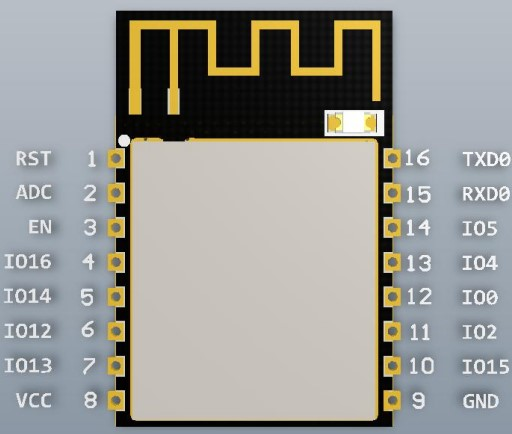
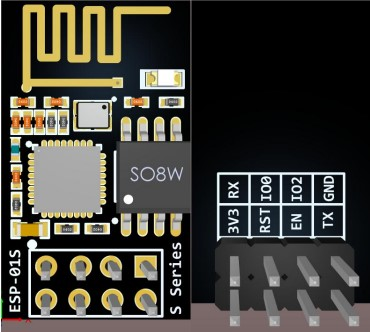

# Burning esp8266 with pico

## Related links
Pico UART-USB bridge picoprobe:
    https://github.com/raspberrypi/picoprobe
    https://www.raspberrypi.com/documentation/microcontrollers/raspberry-pi-pico.html#debugging-using-another-raspberry-pi-pico

esp8266-uart-wsserver firmware:
    https://github.com/sunfounder/esp8266-uart-wsserver/releases

Ai-Thinker's various ESP8266 module specifications summary:
    https://docs.ai-thinker.com/en/%E8%A7%84%E6%A0%BC%E4%B9%A6

## Usage
### 1. Pico to act as a USB-ART converter
- Long press the "BOOTSEL" button on the pico and connect the PC with the USB cable, copy the "picoprobe.uf2" file into the root directory of the pico memory, the pico will automatically install the uf2 file, which will make the GPIO4(TX1), GPIO5(RX1) of the pico become the USB-UART converter.

### 2. Connect esp8266 and pico
- If you are using Pico-4WD, you can skip this step.
- Wiring according to the following table:
   | esp8266 |   pico  |
   | :-:     | :-:     |
   | 3v3     | 3v3     |
   | GND     | GND     |
   | TX      | RX (IO5)|
   | RX      | TX (IO4)|
   | EN      | 3v3     |
   | IO      | GND     |

   
   
   

### 3. Reset esp8266 and enter download mode
- IO0 connect to GND, connect RST to GND and then hang after, esp8266 will enter download mode, generally esp8266 will flash quickly for a while.
- For pico-4wd, you need to use a duplex cable to connect GND and IO0, then turn on the power,make the esp8266 enter the download mode, after that you can release IO0.

### 4. Execute install.bat
- Double click to execute the install.bat file, the program will automatically search the serial port and try to download esp8266-uart-wsserver firmware, if it fails, please reset the esp8266 and re-execute the install.bat.

## Links about SunFounder 
- https://sunfounder.com
- https://docs.sunfounder.com/en/latest/

## Contact us

website:
    ezblock.cc

E-mail:
    service@sunfounder.com
